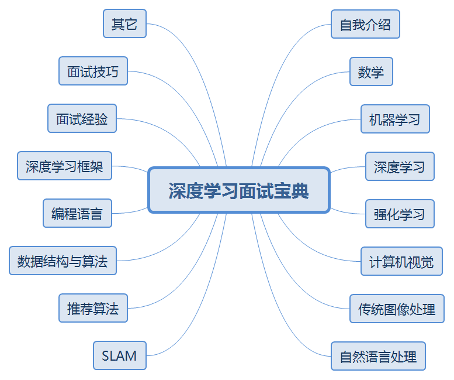

# 深度学习面试宝典

**Deep Learning Interview Book**

- :star: [求职攻略](https://github.com/amusi/AI-Job-Notes)
- :smiley: [自我介绍](docs/自我介绍.md)
- :1234: [数学](docs/数学.md)
- :mortar_board: [机器学习](docs/机器学习.md)
- :closed_book: [深度学习](docs/深度学习.md)
- :green_book: [强化学习](docs/强化学习.md)
- :eyes: [计算机视觉](docs/计算机视觉.md)
- :camera: [传统图像处理](docs/传统图像处理.md)
- :mahjong: [自然语言处理](docs/自然语言处理.md)
- :surfer: [SLAM](docs/SLAM.md)
- :busts_in_silhouette: [推荐算法](docs/推荐算法.md)
- :bar_chart: [数据结构与算法](docs/数据结构与算法.md)
- :snake: [编程语言：C/C++/Python](docs/编程语言.md)
- :fireworks: [深度学习框架](docs/深度学习框架.md)
- :pencil2: [面试经验](docs/面试经验.md)
- :bulb: [面试技巧](docs/面试技巧.md)
- :mega: [其它（计算机网络/Linux等）](docs/其它.md)

