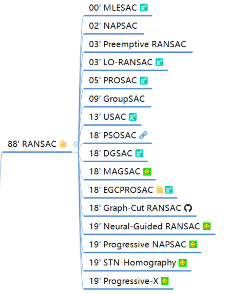

[TOC]

# SLAM

## 001 什么是回环检测？

随着路径的不断延伸，机器人在建图过程中会存在一些累计误差，除了利用局部优化、全局优化等来调整之外，还可以利用回环检测来优化位姿。

**什么是回环检测？**

回环检测，又称闭环检测，是指机器人识别曾到达某场景，使得地图闭环的能力。说的简单点，就是机器人在左转一下，右转一下建图的时候能意识到某个地方是“我”曾经来过的，然后把此刻生成的地图与刚刚生成的地图做匹配。

　　

回环检测成功

回环检测之所以能成为一个难点，是因为：如果回环检测成功，可以显著地减小累积误差，帮助机器人更精准、快速的进行避障导航工作。而错误的检测结果可能使地图变得很糟糕。因此，回环检测在大面积、大场景地图构建上是非常有必要的 。

　

回环检测失败

**如何提升机器人回环检测能力？**

那么，怎么才能让机器人的回环检测能力得到一个质的提升呢？首先要有一个算法上的优化。

**基于图优化的SLAM算法**

基于图优化的SLAM 3.0 算是提升机器人回环检测能力的一大突破。

SLAM 3.0采用图优化的方式进行建图，进行了图片集成与优化处理，当机器人运动到已经探索过的原环境时，SLAM 3.0可依赖内部的拓扑图进行主动式的闭环检测。当发现了新的闭环信息后，SLAM 3.0使用Bundle Adjuestment(BA)等算法对原先的位姿拓扑地图进行修正（即进行图优化），从而能有效的进行闭环后地图的修正，实现更加可靠的环境建图。

**SLAM 3.0闭环检测**

SLAM 3.0环路闭合逻辑：先小闭环，后大闭环 ；选择特征丰富的点作为闭环点；多走重合之路，完善闭环细节。即使在超大场景下建图，也不慌。

超大场景下建图完整闭合过程

**词袋模型**

除了SLAM算法的升级和优化之外，现在还有很多系统采用成熟的词袋模型方法来帮助机器人完成闭环，说的简单点就是把帧与帧之间进行特征比配。

1、从每幅图像中提取特征点和特征描述，特征描述一般是一个多维向量，因此可以计算两个特征描述之间的距离；

2、将这些特征描述进行聚类（比如k－means），类别的个数就是词典的单词数，比如1000；也可以用Beyes、SVM等；

3、将这些词典组织成树的形式，方便搜索。

利用这个树，就可以将时间复杂度降低到对数级别，大大加速了特征匹配。

**相似度计算**

这种做法是从外观上根据两幅图像的相似性确定回环检测关系，那么，如何确定两个地图之间的相关性呢？

比如对于图像A和图像B，我们要计算它们之间的相似性评分：s(A,B)。如果单单用两幅图像相减然后取范数，即为： s(A,B)=||AB||s(A,B)=||AB||。但是由于一幅图像在不同角度或者不同光线下其结果会相差很多，所以不使用这个函数。而是使用相似度计算公式。

这里，我们提供一种方法叫TF-IDF。

TF的意思是：某特征在一幅图像中经常出现，它的区分度就越高。另一方面，IDF的思想是，某特征在字典中出现的频率越低，则分类图像时的区分度越高。

对于IDF部分，假设所有特征数量为n，某个节点的Wi所含的数量特征为Ni，那么该单词的IDF为：

TF是指某个特征在单副图像中出现的频率。假设图像A中单词Wi出现了N次，而一共出现的单词次数是n，那么TF为：

于是Wi的权重等于TF乘IDF之积，即：

考虑权重以后，对于某副图像，我们可以得到许多个单词，得到BOW：

（A表示某幅地图）

如何计算俩副图像相似度，这里使用了L1范数形式：

**深度学习及其他**

除了上面的几种方式之外，回环检测也可以建成一个模型识别问题，利用深度学习的方法帮助机器人完成回环检测。比如：决策树、SVM等。

……

最后，当回环出现以后，也不要急着就让机器人停止运动，要继续保持运动，多走重合的路，在已经完成闭合的路径上，进一步扫图完善细节。

　

继续走重合之路，完善闭环细节

所以，回环检测在SLAM中的作用也很重要哦。

**参考资料**

- [SLAM大法之回环检测](https://baijiahao.baidu.com/s?id=1627227355343777871)

## 002 常用的回环检测方法有哪些？

- [ ] TODO

## 003 介绍一下Gauss-Netwon和LM算法

- [ ] TODO

## 004 介绍一下Ceres优化库，比如你使用过里面哪些内容？

- [ ] TODO

## 005 描述（扩展）卡尔曼滤波与粒子滤波，你自己在用卡尔曼滤波时遇到什么问题没有？

- [ ] TODO

## 006 除了视觉传感，还用过其他传感吗？比如GPS，激光雷达

- [ ] TODO

## 007 什么是紧耦合、松耦合？优缺点

- [ ] TODO

## 008 你认为室内SLAM与自动驾驶SLAM有什么区别？

- [ ] TODO

## 009 地图点的构建方法有哪些？

TODO

## 010 如果对于一个3D点，我们在连续帧之间形成了2D特征点之间的匹配，但是这个匹配中可能存在错误的匹配。请问你如何去构建3D点？

- [ ] TODO

## 011 RANSAC在选择最佳模型的时候用的metric是什么？

- [ ] TODO

## 012 除了RANSAC之外，还有什么鲁棒估计的方法？

- [ ] TODO

## 013 有哪几种鲁棒核函数？

- [ ] TODO

## 014 3D地图点是怎么存储的？表达方式？

## 015 给你m相机n个点的bundle adjustment。当我们在仿真的时候，在迭代的时候，相机的位姿会很快的接近真值。而地图点却不能很快的收敛这是为什么呢？

- [ ] TODO

## 016 LM算法里面那个  是如何变化的呢？

- [ ] TODO

## 017 说一下3D空间的位姿如何去表达?

- [ ] TODO

## 018 介绍一下李群和李代数的关系

- [ ] TODO

## 019 写出单目相机的投影模型，畸变模型

- [ ] TODO

## 020 说一个自己熟悉的SLAM算法，Lidar/Visual slam，说优缺点

- [ ] TODO

## 021 读Maplab，设计室内服务机器人地图更新的方法、流程

- [ ] TODO

## 022 安装2D lidar的平台匀速旋转的时候，去激光数据畸变，写代码

- [ ] TODO

## 023 给两组已经匹配好的3D点，计算相对位姿变换。已知匹配的ICP问题，写代码。

- [ ] TODO

## 024 ORB-SLAM初始化的时候为什么要同时计算H矩阵和F矩阵？

- [ ] TODO

## 025 说一下Dog-Leg算法

- [ ] TODO

## 026 什么是边缘化？First Estimate Jacobian？一致性？可观性？

- [ ] TODO

## 027 说一下VINS-Mono的优缺点

- [ ] TODO

## 028 什么是Essential，Fundamental矩阵？

TODO

## 029 给定几个连续帧的带有位姿的帧，如何去测量车道线相对于世界坐标系的坐标。

- [ ] TODO

## 030 在给定一些有噪声的GPS信号的时候如何去精准的定位？

- [ ] TODO

## 031 如何标定IMU与相机之间的外参数？

- [ ] TODO

## 032 给你xx误差的GPS，给你xx误差的惯导你怎么得到一个cm级别的地图？

- [ ] TODO

## 033 计算H矩阵和F矩阵的时候有什么技巧呢？实际上在问归一化的操作

- [ ] TODO

## 034 给一组点云，从中提取平面

- [ ] TODO

## 035 给一张图片，知道相机与地面之间的相对关系，计算出图的俯视图

- [ ] TODO

## 036 RGB-D的SLAM和RGB的SLAM有什么区别？

- [ ] TODO

## 037 机器人从超市门口出发，前往3公里外的小区送货。请你设计一个定位系统，包括传感器的配置、算法的流程，用伪代码写出来

- [ ] TODO

## 038 什么是ORB特征，ORB特征的旋转不变性是如何做的，BRIEF算子是怎么提取的。

- [ ] TODO

## 039 如果把一张图像去畸变，写公式，流程

- [ ] TODO

## 040 ORB-SLAM中的特征是如何提取的？如何均匀化的？

- [ ] TODO

## 参考

- [SLAM、定位、建图求职分享](https://zhuanlan.zhihu.com/p/68858564)

