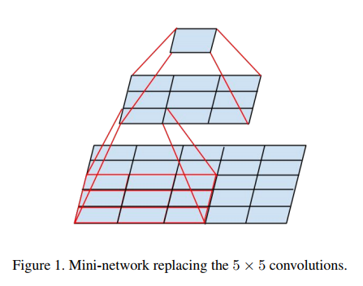
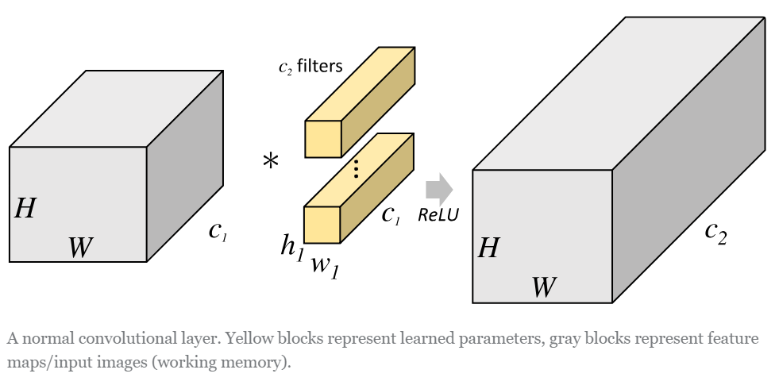
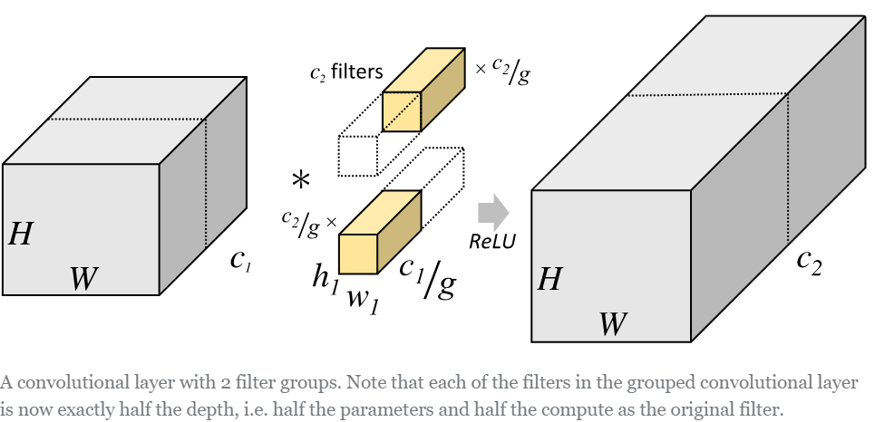
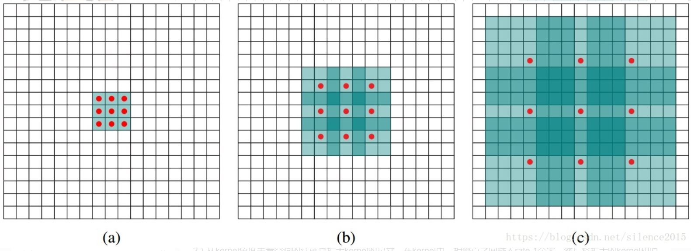
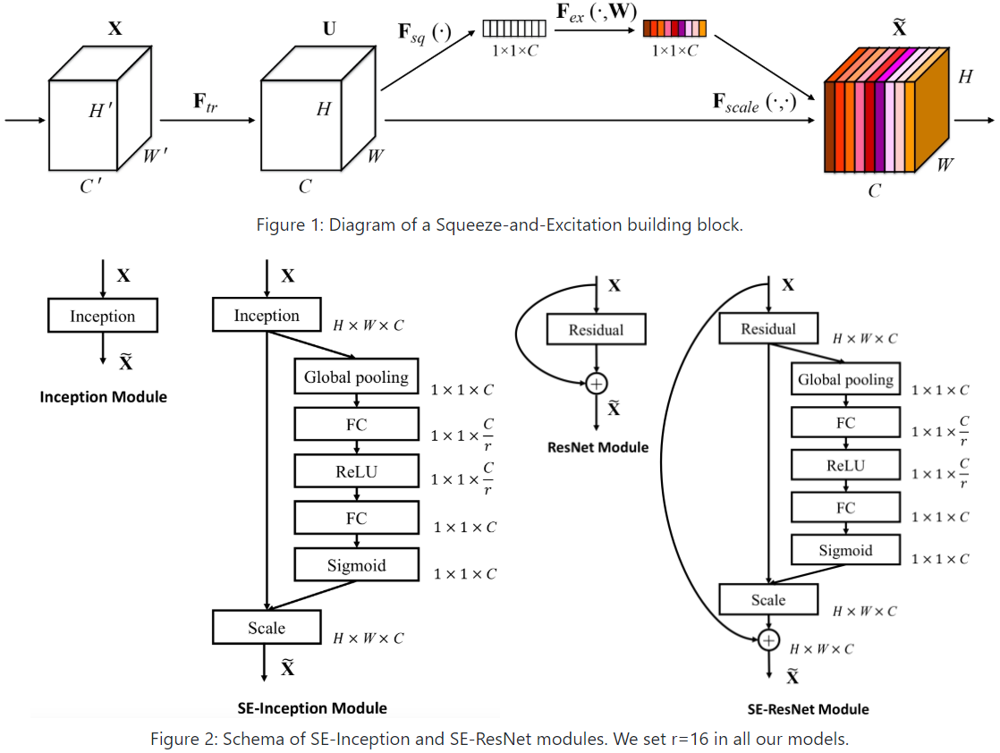
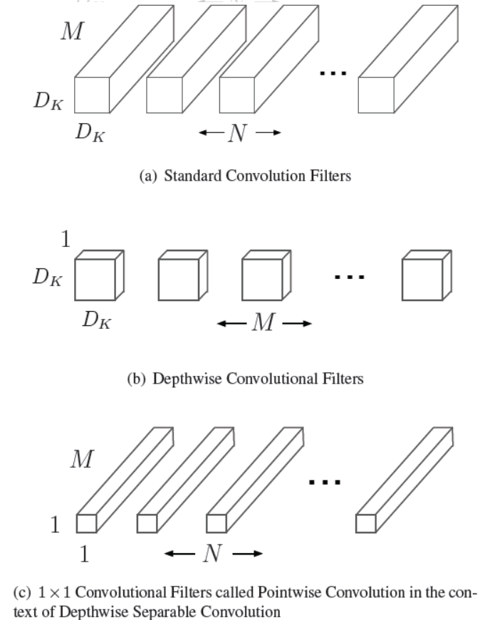
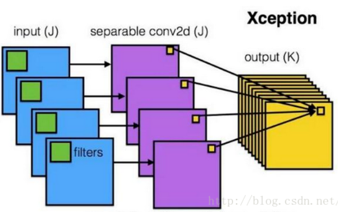

[TOC]

# 深度学习

## 神经网络中的Epoch、Iteration、Batchsize

神经网络中epoch与iteration是不相等的

- batchsize：中文翻译为批大小（批尺寸）。在深度学习中，一般采用SGD训练，即每次训练在训练集中取batchsize个样本训练；

- iteration：中文翻译为迭代，1个iteration等于使用batchsize个样本训练一次；一个迭代 = 一个正向通过+一个反向通过

- epoch：迭代次数，1个epoch等于使用训练集中的全部样本训练一次；一个epoch = 所有训练样本的一个正向传递和一个反向传递

举个例子，训练集有1000个样本，batchsize=10，那么：训练完整个样本集需要：100次iteration，1次epoch。


**参考资料**

- [神经网络中的Epoch、Iteration、Batchsize](https://zhuanlan.zhihu.com/p/67414365)
- [神经网络中epoch与iteration相等吗](https://zhidao.baidu.com/question/716300338908227765.html)

## 反向传播（BP）

- [ ] TODO

**参考资料**

- [一文搞懂反向传播算法](https://www.jianshu.com/p/964345dddb70)

## CNN本质和优势

局部卷积（提取局部特征）

权值共享（降低训练难度）

Pooling（降维，将低层次组合为高层次的特征）

多层次结构

## 鞍点的定义和特点？

- [ ] TODO

## 神经网络数据预处理方法有哪些？

- [ ] TODO

## 神经网络怎样进行参数初始化？

- [ ] TODO

## 卷积


- [ ] TODO

**参考资料**

- [Feature Extraction Using Convolution](http://ufldl.stanford.edu/tutorial/supervised/FeatureExtractionUsingConvolution/)
- [convolution](https://leonardoaraujosantos.gitbooks.io/artificial-inteligence/content/convolution.html)

- [理解图像卷积操作的意义](https://blog.csdn.net/chaipp0607/article/details/72236892?locationNum=9&fps=1)

- [关于深度学习中卷积核操作](https://www.cnblogs.com/Yu-FeiFei/p/6800519.html)

### 卷积的反向传播过程

- [ ] TODO

**参考资料**

- [Notes on Convolutional Neural Network](http://cogprints.org/5869/1/cnn_tutorial.pdf)
- [Deep Learning论文笔记之（四）CNN卷积神经网络推导和实现](https://blog.csdn.net/zouxy09/article/details/9993371)

- [反向传导算法](http://deeplearning.stanford.edu/wiki/index.php/%E5%8F%8D%E5%90%91%E4%BC%A0%E5%AF%BC%E7%AE%97%E6%B3%95)

- [Deep learning：五十一(CNN的反向求导及练习)](https://www.cnblogs.com/tornadomeet/p/3468450.html)

- [卷积神经网络(CNN)反向传播算法](https://www.cnblogs.com/pinard/p/6494810.html)

- [卷积神经网络(CNN)反向传播算法公式详细推导](https://blog.csdn.net/walegahaha/article/details/51945421)

- [全连接神经网络中反向传播算法数学推导](https://zhuanlan.zhihu.com/p/61863634)

- [卷积神经网络(CNN)反向传播算法推导](https://zhuanlan.zhihu.com/p/61898234)


## CNN 模型所需的计算力（flops）和参数（parameters）数量是怎么计算的？

对于一个卷积层，假设其大小为  （其中c为#input channel, n为#output channel），输出的feature map尺寸为  ，则该卷积层的

- paras =

- FLOPs = 


- [ ] TODO

**参考资料**


- [CNN 模型所需的计算力（flops）和参数（parameters）数量是怎么计算的？](https://www.zhihu.com/question/65305385/answer/256845252)
- [CNN中parameters和FLOPs计算](https://blog.csdn.net/sinat_34460960/article/details/84779219)
- [FLOPS理解](https://blog.csdn.net/smallhujiu/article/details/80876875)
- [PyTorch-OpCounter](https://github.com/Lyken17/pytorch-OpCounter)

## 池化（Pooling）

**平均池化（Mean Pooling）**

mean pooling的前向传播就是把一个patch中的值求取平均来做pooling，那么反向传播的过程也就是把某个元素的梯度等分为n份分配给前一层，这样就保证池化前后的梯度（残差）之和保持不变，还是比较理解的，图示如下 


**最大池化（Max Pooling）**

max pooling也要满足梯度之和不变的原则，max pooling的前向传播是把patch中最大的值传递给后一层，而其他像素的值直接被舍弃掉。那么反向传播也就是把梯度直接传给前一层某一个像素，而其他像素不接受梯度，也就是为0。所以max pooling操作和mean pooling操作不同点在于需要记录下池化操作时到底哪个像素的值是最大，也就是max id，这个可以看caffe源码的pooling_layer.cpp，下面是caffe框架max pooling部分的源码

```python

// If max pooling, we will initialize the vector index part.

if (this->layer_param_.pooling_param().pool() == PoolingParameter_PoolMethod_MAX && top.size() == 1)

{

    max_idx_.Reshape(bottom[0]->num(), channels_, pooled_height_,pooled_width_);

  }

```


**参考资料**

- [如何理解CNN中的池化？](https://zhuanlan.zhihu.com/p/35769417)
- [深度学习笔记（3）——CNN中一些特殊环节的反向传播](https://blog.csdn.net/qq_21190081/article/details/72871704)

### 池化层怎么接收后面传过来的损失？

- [ ] TODO

### 平均池化（average pooling）

- [ ] TODO

### 最大池化（max pooling）

- [ ] TODO

## 感受野

### 感受野计算

- [ ] TODO

**参考资料**

- [卷积神经网络物体检测之感受野大小计算](https://www.cnblogs.com/objectDetect/p/5947169.html)
- [如何计算感受野(Receptive Field)——原理](https://zhuanlan.zhihu.com/p/31004121)
- [Computing Receptive Fields of Convolutional Neural Networks](https://distill.pub/2019/computing-receptive-fields/)


### 卷积神经网络的感受野

- [ ] TODO

**参考资料**

- [卷积神经网络的感受野](https://zhuanlan.zhihu.com/p/44106492)

## 权重初始化方法

- [ ] TODO

### Xavier

- [ ] TODO

## 正则化方法

1. [参数范数惩罚](https://baike.baidu.com/item/%E6%AD%A3%E5%88%99%E5%8C%96%E6%96%B9%E6%B3%95/19145625?fr=aladdin#1)
2. [L2参数正则化](https://baike.baidu.com/item/%E6%AD%A3%E5%88%99%E5%8C%96%E6%96%B9%E6%B3%95/19145625?fr=aladdin#2)
3. [L1参数正则化](https://baike.baidu.com/item/%E6%AD%A3%E5%88%99%E5%8C%96%E6%96%B9%E6%B3%95/19145625?fr=aladdin#3)
4. [L1正则化和L2正则化的区别](https://baike.baidu.com/item/%E6%AD%A3%E5%88%99%E5%8C%96%E6%96%B9%E6%B3%95/19145625?fr=aladdin#4)
5.  [数据集增强](https://baike.baidu.com/item/%E6%AD%A3%E5%88%99%E5%8C%96%E6%96%B9%E6%B3%95/19145625?fr=aladdin#5)
6.  [噪音的鲁棒性](https://baike.baidu.com/item/%E6%AD%A3%E5%88%99%E5%8C%96%E6%96%B9%E6%B3%95/19145625?fr=aladdin#6)
7. [向输出目标注入噪声](https://baike.baidu.com/item/%E6%AD%A3%E5%88%99%E5%8C%96%E6%96%B9%E6%B3%95/19145625?fr=aladdin#7)
8.  [半监督学习](https://baike.baidu.com/item/%E6%AD%A3%E5%88%99%E5%8C%96%E6%96%B9%E6%B3%95/19145625?fr=aladdin#8)
9.  [多任务学习](https://baike.baidu.com/item/%E6%AD%A3%E5%88%99%E5%8C%96%E6%96%B9%E6%B3%95/19145625?fr=aladdin#9)
10. [提前终止](https://baike.baidu.com/item/%E6%AD%A3%E5%88%99%E5%8C%96%E6%96%B9%E6%B3%95/19145625?fr=aladdin#10)
11. [参数绑定和共享](https://baike.baidu.com/item/%E6%AD%A3%E5%88%99%E5%8C%96%E6%96%B9%E6%B3%95/19145625?fr=aladdin#11)
12. [稀疏表示](https://baike.baidu.com/item/%E6%AD%A3%E5%88%99%E5%8C%96%E6%96%B9%E6%B3%95/19145625?fr=aladdin#12)
13. [集成化方法](https://baike.baidu.com/item/%E6%AD%A3%E5%88%99%E5%8C%96%E6%96%B9%E6%B3%95/19145625?fr=aladdin#13)

**参考资料**

- [ ] [正则化方法](https://baike.baidu.com/item/%E6%AD%A3%E5%88%99%E5%8C%96%E6%96%B9%E6%B3%95/19145625?fr=aladdin)

## Batch Normalization（BN）

### BN 原理

- [ ] TODO

**参考资料**

- [Batch Normalization原理与实战](https://zhuanlan.zhihu.com/p/34879333)

### 手写 BN

- [ ] TODO

### BN 可以防止过拟合么？为什么

- [ ] TODO

### BN 有哪些参数？

- [ ] TODO

### BN 的反向传播推导

- [ ] TODO

### BN 在训练和测试的区别？

- [ ] TODO

## Weight Normalization（WN）

- [ ] TODO

## Layer Normalization（LN）

- [ ] TODO

## Instance Normalization（IN）

- [ ] TODO

## Group Normalization（GN）

- [ ] TODO

### BN、LN、WN、IN和GN的区别

- [ ] TODO

**参考资料**

- [BatchNormalization、LayerNormalization、InstanceNorm、GroupNorm、SwitchableNorm总结](https://blog.csdn.net/liuxiao214/article/details/81037416)

## 优化算法

- 随机梯度下降（SGD）
- Mini-Batch
- 动量（Momentum）
- Nesterov 动量
- AdaGrad
- AdaDelta
- RMSProp
- Adam
- Adamax
- Nadam
- [AMSGrad](http://ruder.io/optimizing-gradient-descent/index.html#amsgrad)
- AdaBound

**参考资料**

- [《Deep Learning》第八章：深度模型中的优化](https://exacity.github.io/deeplearningbook-chinese/Chapter8_optimization_for_training_deep_models/)

- [从 SGD 到 Adam —— 深度学习优化算法概览(一)](https://zhuanlan.zhihu.com/p/32626442)
- [Adam 究竟还有什么问题 —— 深度学习优化算法概览(二)](https://zhuanlan.zhihu.com/p/37269222)
- [An overview of gradient descent optimization algorithms](http://ruder.io/optimizing-gradient-descent/)

### 梯度下降法

- [ ] TODO

### mini-batch梯度下降法

- [ ] TODO

### 随机梯度下降法（SGD）

#### SGD每步做什么，为什么能online learning？

- [ ] TODO

### 动量梯度下降法（Momentum）

- [ ] TODO


**参考资料**

- [简述动量Momentum梯度下降](https://blog.csdn.net/yinruiyang94/article/details/77944338)

### RMSprop

$$
S_{dW}=\beta S_{dW}+\left ( 1-\beta  \right )dW^{2}
$$

$$
S_{db}=\beta S_{db}+\left ( 1-\beta  \right )db^{2}
$$

$$
W=W-\alpha\frac{dW}{\sqrt{S_{dW}}}, b=b-\alpha\frac{db}{\sqrt{S_{db}}}
$$

- [ ] TODO

### Adagrad

- [ ] TODO

### Adam

Adam算法结合了Momentum和RMSprop梯度下降法，是一种极其常见的学习算法，被证明能有效适用于不同神经网络，适用于广泛的结构。
$$
v_{dW}=\beta_{1} v_{dW}+\left ( 1-\beta_{1}  \right )dW
$$

$$
v_{db}=\beta_{1} v_{db}+\left ( 1-\beta_{1}  \right )db
$$

$$
S_{dW}=\beta_{2} S_{dW}+\left ( 1-\beta_{2}  \right )dW^{2}
$$

$$
S_{db}=\beta_{2} S_{db}+\left ( 1-\beta_{2}  \right )db^{2}
$$

$$
v_{dW}^{corrected}=\frac{v_{dW}}{1-\beta_{1}^{t}}
$$

$$
v_{db}^{corrected}=\frac{v_{db}}{1-\beta_{1}^{t}}
$$

$$
S_{dW}^{corrected}=\frac{S_{dW}}{1-\beta_{2}^{t}}
$$

$$
S_{db}^{corrected}=\frac{S_{db}}{1-\beta_{2}^{t}}
$$

$$
W:=W-\frac{av_{dW}^{corrected}}{\sqrt{S_{dW}^{corrected}}+\varepsilon }
$$

超参数：
$$
\alpha ,\beta _{1},\beta_{2},\varepsilon
$$

$$
\alpha ,\beta _{1},\beta_{2},\varepsilon
$$
- [ ] TODO 

#### Adam 优化器的迭代公式

- [ ] TODO

## 激活函数

- [ ] TODO

**参考资料**

- [What is activate function?](https://yogayu.github.io/DeepLearningCourse/03/ActivateFunction.html)
- [资源 | 从ReLU到Sinc，26种神经网络激活函数可视化](https://mp.weixin.qq.com/s/7DgiXCNBS5vb07WIKTFYRQ)

### Sigmoid

- [ ] TODO

#### Sigmoid用作激活函数时，分类为什么要用交叉熵损失，而不用均方损失？

- [ ] TODO

### tanh

- [ ] TODO

### ReLU

- [ ] TODO

ReLU 相关变体

#### ReLU 激活函数为什么比sigmoid和tanh好？ 

- [ ] TODO

#### ReLU 激活函数为什么能解决梯度消失问题？

- [ ] TODO

#### ReLU 有哪些变体？

- [ ] TODO

## Dropout

### Dropout 基本原理

- [ ] TODO

**参考资料**

- [理解dropout](https://blog.csdn.net/stdcoutzyx/article/details/49022443)

### Dropout 如何实现？

- [ ] TODO

### Drop 在训练和测试的区别

- [ ] TODO

## 损失函数（Loss）

- [ ] TODO

### Cross Entropy Loss（CE）

- [ ] TODO

### Hinge Loss

- [ ] TODO

### Focal Loss

- [ ] TODO

## 1*1 卷积有什么作用？

- [ ] TODO

## AlexNet

- 使用ReLU激活函数
- Dropout
- 数据增广

先给出AlexNet的一些参数和结构图： 

卷积层：5层 

全连接层：3层 

深度：8层 

参数个数：60M 

神经元个数：650k 

分类数目：1000类

**参考资料**

[AlexNet](https://dgschwend.github.io/netscope/#/preset/alexnet)

## VGG

**《Very Deep Convolutional Networks for Large-Scale Image Recognition》**

- arXiv：https://arxiv.org/abs/1409.1556
- intro：ICLR 2015
- homepage：http://www.robots.ox.ac.uk/~vgg/research/very_deep/

[VGG](https://arxiv.org/abs/1409.1556) 是Oxford的**V**isual **G**eometry **G**roup的组提出的（大家应该能看出VGG名字的由来了）。该网络是在ILSVRC 2014上的相关工作，主要工作是证明了增加网络的深度能够在一定程度上影响网络最终的性能。VGG有两种结构，分别是VGG16和VGG19，两者并没有本质上的区别，只是网络深度不一样。

VGG16相比AlexNet的一个改进是采用**连续的几个3x3的卷积核代替AlexNet中的较大卷积核（11x11，7x7，5x5）**。对于给定的感受野（与输出有关的输入图片的局部大小），**采用堆积的小卷积核是优于采用大的卷积核，因为多层非线性层可以增加网络深度来保证学习更复杂的模式，而且代价还比较小（参数更少）**。

简单来说，在VGG中，使用了3个3x3卷积核来代替7x7卷积核，使用了2个3x3卷积核来代替5*5卷积核，这样做的主要目的是在保证具有相同感知野的条件下，提升了网络的深度，在一定程度上提升了神经网络的效果。

比如，3个步长为1的3x3卷积核的一层层叠加作用可看成一个大小为7的感受野（其实就表示3个3x3连续卷积相当于一个7x7卷积），其参数总量为 3x(9xC^2) ，如果直接使用7x7卷积核，其参数总量为 49xC^2 ，这里 C 指的是输入和输出的通道数。很明显，27xC^2小于49xC^2，即减少了参数；而且3x3卷积核有利于更好地保持图像性质。

这里解释一下为什么使用2个3x3卷积核可以来代替5*5卷积核：

5x5卷积看做一个小的全连接网络在5x5区域滑动，我们可以先用一个3x3的卷积滤波器卷积，然后再用一个全连接层连接这个3x3卷积输出，这个全连接层我们也可以看做一个3x3卷积层。这样我们就可以用两个3x3卷积级联（叠加）起来代替一个 5x5卷积。

具体如下图所示：



至于为什么使用3个3x3卷积核可以来代替7*7卷积核，推导过程与上述类似，大家可以自行绘图理解。

下面是VGG网络的结构（VGG16和VGG19都在）：


- VGG16包含了16个隐藏层（13个卷积层和3个全连接层），如上图中的D列所示
- VGG19包含了19个隐藏层（16个卷积层和3个全连接层），如上图中的E列所示

VGG网络的结构非常一致，从头到尾全部使用的是3x3的卷积和2x2的max pooling。

如果你想看到更加形象化的VGG网络，可以使用[经典卷积神经网络（CNN）结构可视化工具](https://mp.weixin.qq.com/s/gktWxh1p2rR2Jz-A7rs_UQ)来查看高清无码的[VGG网络](https://dgschwend.github.io/netscope/#/preset/vgg-16)。

**VGG优点：**

- VGGNet的结构非常简洁，整个网络都使用了同样大小的卷积核尺寸（3x3）和最大池化尺寸（2x2）。
- 几个小滤波器（3x3）卷积层的组合比一个大滤波器（5x5或7x7）卷积层好：
- 验证了通过不断加深网络结构可以提升性能。

**VGG缺点**：

VGG耗费更多计算资源，并且使用了更多的参数（这里不是3x3卷积的锅），导致更多的内存占用（140M）。其中绝大多数的参数都是来自于第一个全连接层。VGG可是有3个全连接层啊！

PS：有的文章称：发现这些全连接层即使被去除，对于性能也没有什么影响，这样就显著降低了参数数量。

注：很多pretrained的方法就是使用VGG的model（主要是16和19），VGG相对其他的方法，参数空间很大，最终的model有500多m，AlexNet只有200m，GoogLeNet更少，所以train一个vgg模型通常要花费更长的时间，所幸有公开的pretrained model让我们很方便的使用。

关于感受野：

假设你一层一层地重叠了3个3x3的卷积层（层与层之间有非线性激活函数）。在这个排列下，第一个卷积层中的每个神经元都对输入数据体有一个3x3的视野。

**代码篇：VGG训练与测试**

这里推荐两个开源库，训练请参考[tensorflow-vgg](https://github.com/machrisaa/tensorflow-vgg)，快速测试请参考[VGG-in TensorFlow](https://www.cs.toronto.edu/~frossard/post/vgg16/)。

代码我就不介绍了，其实跟上述内容一致，跟着原理看code应该会很快。我快速跑了一下[VGG-in TensorFlow](https://www.cs.toronto.edu/~frossard/post/vgg16/)，代码亲测可用，效果很nice，就是model下载比较烦。

贴心的Amusi已经为你准备好了[VGG-in TensorFlow](https://www.cs.toronto.edu/~frossard/post/vgg16/)的测试代码、model和图像。需要的同学可以关注CVer微信公众号，后台回复：VGG。

天道酬勤，还有很多知识要学，想想都刺激~Fighting！

**参考资料**

- [《Very Deep Convolutional Networks for Large-Scale Image Recognition》](https://arxiv.org/abs/1409.1556)
- [深度网络VGG理解](https://blog.csdn.net/wcy12341189/article/details/56281618)

- [深度学习经典卷积神经网络之VGGNet](https://blog.csdn.net/marsjhao/article/details/72955935)
- [VGG16 结构可视化](https://dgschwend.github.io/netscope/#/preset/vgg-16)

- [tensorflow-vgg](https://github.com/machrisaa/tensorflow-vgg)

- [VGG-in TensorFlow](https://www.cs.toronto.edu/~frossard/post/vgg16/)

- [机器学习进阶笔记之五 | 深入理解VGG\Residual Network](https://zhuanlan.zhihu.com/p/23518167)


## ResNet

**1.ResNet意义**

随着网络的加深，出现了训练集准确率下降的现象，我们可以确定这不是由于Overfit过拟合造成的(过拟合的情况训练集应该准确率很高)；所以作者针对这个问题提出了一种全新的网络，叫深度残差网络，它允许网络尽可能的加深，其中引入了全新的结构如图1； 
这里问大家一个问题 

残差指的是什么？ 

其中ResNet提出了两种mapping：一种是identity mapping，指的就是图1中”弯弯的曲线”，另一种residual mapping，指的就是除了”弯弯的曲线“那部分，所以最后的输出是 y=F(x)+x 
identity mapping顾名思义，就是指本身，也就是公式中的x，而residual mapping指的是“差”，也就是y−x，所以残差指的就是F(x)部分。 

为什么ResNet可以解决“随着网络加深，准确率不下降”的问题？ 

理论上，对于“随着网络加深，准确率下降”的问题，Resnet提供了两种选择方式，也就是identity mapping和residual mapping，如果网络已经到达最优，继续加深网络，residual mapping将被push为0，只剩下identity mapping，这样理论上网络一直处于最优状态了，网络的性能也就不会随着深度增加而降低了。

**2.ResNet结构**

它使用了一种连接方式叫做“shortcut connection”，顾名思义，shortcut就是“抄近道”的意思，看下图我们就能大致理解： 

**ResNet的F(x)究竟长什么样子？**

**参考资料**

- [ResNet解析](https://blog.csdn.net/lanran2/article/details/79057994)
- [ResNet论文笔记](https://blog.csdn.net/wspba/article/details/56019373)

- [残差网络ResNet笔记](https://www.jianshu.com/p/e58437f39f65)
- [Understand Deep Residual Networks — a simple, modular learning framework that has redefined state-of-the-art](https://blog.waya.ai/deep-residual-learning-9610bb62c355)

- [An Overview of ResNet and its Variants](https://towardsdatascience.com/an-overview-of-resnet-and-its-variants-5281e2f56035)     


- [译文](https://www.jianshu.com/p/46d76bd56766)
- [Understanding and Implementing Architectures of ResNet and ResNeXt for state-of-the-art Image Classification: From Microsoft to Facebook [Part 1]](https://medium.com/@14prakash/understanding-and-implementing-architectures-of-resnet-and-resnext-for-state-of-the-art-image-cf51669e1624)
- [给妹纸的深度学习教学(4)——同Residual玩耍](https://zhuanlan.zhihu.com/p/28413039)
- [Residual Networks 理解](https://zhuanlan.zhihu.com/p/32173684)
- [Identity Mapping in ResNet](https://zhuanlan.zhihu.com/p/32206896)
- [resnet（残差网络）的F（x）究竟长什么样子？](https://www.zhihu.com/question/53224378)
- [ResNet到底在解决一个什么问题呢？](https://www.zhihu.com/question/64494691)

### ResNet为什么不用Dropout?

- [ ] TODO

**参考资料**

- <https://www.zhihu.com/question/325139089>
- https://zhuanlan.zhihu.com/p/60923972

### 为什么 ResNet 不在一开始就使用residual block,而是使用一个7×7的卷积？

先上一下paper里的图例：


原因: 7x7卷积实际上是用来直接对**输入图片**降采样(early downsampling), 注意像7x7这样的大卷积核一般只出现在**input layer**

**目的是:**  尽可能**保留原始图像的信息,** 而不需要增加channels数.

**本质上是:** 多channels的非线性激活层是非常昂贵的, 在**input laye**r用**big kernel**换多channels是划算的

注意一下, resnet接入residual block前pixel为56x56的layer, channels数才**64**, 但是同样大小的layer, 在vgg-19里已经有**256**个channels了.

这里要强调一下, 只有在input layer层, 也就是**最靠近输入图片**的那层, 才用大卷积, 原因如下:

深度学习领域, 有一种广泛的直觉，即更大的卷积更好，但更昂贵。输入层中的特征数量(224x224)是如此之小（相对于隐藏层），第一卷积可以非常大而不会大幅增加实际的权重数。**如果你想在某个地方进行大卷积，第一层通常是唯一的选择**。

我认为神经网络的第一层是最基本的，因为它基本上只是将数据嵌入到一个新的更大的向量空间中。ResNet在第二层之前没有开始其特征层跳过，所以看起来作者想要在开始整花里胡哨的layers之前尽可能保留图像里更多的primary features.

题外话, 同时期的GoogLeNet也在input layer用到了7x7大卷积, 所以resnet作者的灵感来源于GoogLeNet也说不定, 至于非要追问为啥这么用, 也许最直接的理由就是"深度学习就像炼丹, 因为这样网络工作得更好, 所以作者就这么用了". 

再说个有趣的例子, resnet模型是实验先于理论, 实验证明有效, 后面才陆续有人研究为啥有效, 比如[The Shattered Gradients Problem: If resnets are the answer, then what is the question?](https://link.zhihu.com/?target=https%3A//arxiv.org/abs/1702.08591)  可不就是炼丹么?

**参考资料**

- [为什么resnet不在一开始就使用residual block,而是使用一个7×7的卷积？](https://www.zhihu.com/question/330735327/answer/725695411)

### 什么是Bottlenet layer？

- [ ] TODO

### ResNet如何解决梯度消失？

- [ ] TODO

### ResNet网络越来越深，准确率会不会提升？

- [ ] TODO

## ResNet v2


**参考资料**

- [《Identity Mappings in Deep Residual Networks》](https://arxiv.org/abs/1603.05027)
- [Feature Extractor[ResNet v2]](https://www.cnblogs.com/shouhuxianjian/p/7770658.html)
- [ResNetV2：ResNet深度解析](https://blog.csdn.net/lanran2/article/details/80247515)
- [ResNet v2论文笔记](https://blog.csdn.net/u014061630/article/details/80558661)
- [[ResNet系] 002 ResNet-v2](https://segmentfault.com/a/1190000011228906)

### ResNet v1 与 ResNet v2的区别

- [ ] TODO

### ResNet v2 的 ReLU 激活函数有什么不同？

- [ ] TODO

## ResNeXt

- [ ] TODO

**参考资料**

- [ResNeXt算法详解](https://blog.csdn.net/u014380165/article/details/71667916)

## Inception系列（V1-V4）

### InceptionV1

- [ ] TODO

### InceptionV2

- [ ] TODO

### InceptionV3

- [ ] TODO

### InceptionV4

- [ ] TODO

**参考资料**

- [一文概览Inception家族的「奋斗史」](https://baijiahao.baidu.com/s?id=1601882944953788623&wfr=spider&for=pc)
- [inception-v1,v2,v3,v4----论文笔记](https://blog.csdn.net/weixin_39953502/article/details/80966046)

## DenseNet

- [ ] TODO

### 为什么 DenseNet 比 ResNet 好？

- [ ] TODO

### 为什么 DenseNet 比 ResNet 更耗显存？

- [ ] TODO

## SE-Net

- [ ] TODO

### Squeeze-Excitation结构是怎么实现的？

TODO

## FCN

一句话概括就是：FCN将传统网络后面的全连接层换成了卷积层，这样网络输出不再是类别而是 heatmap；同时为了解决因为卷积和池化对图像尺寸的影响，提出使用上采样的方式恢复。

作者的FCN主要使用了三种技术：

- 卷积化（Convolutional）

- 上采样（Upsample）
- 跳跃结构（Skip Layer）

卷积化

卷积化即是将普通的分类网络，比如VGG16，ResNet50/101等网络丢弃全连接层，换上对应的卷积层即可。

上采样

此处的上采样即是反卷积（Deconvolution）。当然关于这个名字不同框架不同，Caffe和Kera里叫Deconvolution，而tensorflow里叫conv_transpose。CS231n这门课中说，叫conv_transpose更为合适。

众所诸知，普通的池化（为什么这儿是普通的池化请看后文）会缩小图片的尺寸，比如VGG16 五次池化后图片被缩小了32倍。为了得到和原图等大的分割图，我们需要上采样/反卷积。

反卷积和卷积类似，都是相乘相加的运算。只不过后者是多对一，前者是一对多。而反卷积的前向和后向传播，只用颠倒卷积的前后向传播即可。所以无论优化还是后向传播算法都是没有问题。

跳跃结构（Skip Layers）

（这个奇怪的名字是我翻译的，好像一般叫忽略连接结构）这个结构的作用就在于优化结果，因为如果将全卷积之后的结果直接上采样得到的结果是很粗糙的，所以作者将不同池化层的结果进行上采样之后来优化输出。

上采样获得与输入一样的尺寸
文章采用的网络经过5次卷积+池化后，图像尺寸依次缩小了 2、4、8、16、32倍，对最后一层做32倍上采样，就可以得到与原图一样的大小

作者发现，仅对第5层做32倍反卷积（deconvolution），得到的结果不太精确。于是将第 4 层和第 3 层的输出也依次反卷积（图５）

**参考资料**

[【总结】图像语义分割之FCN和CRF](https://zhuanlan.zhihu.com/p/22308032)

[图像语义分割（1）- FCN](https://blog.csdn.net/zizi7/article/details/77093447)

[全卷积网络 FCN 详解](https://www.cnblogs.com/gujianhan/p/6030639.html)

## U-Net

本文介绍一种编码器-解码器结构。编码器逐渐减少池化层的空间维度，解码器逐步修复物体的细节和空间维度。编码器和解码器之间通常存在快捷连接，因此能帮助解码器更好地修复目标的细节。U-Net 是这种方法中最常用的结构。

fcn(fully convolutional natwork)的思想是：修改一个普通的逐层收缩的网络，用上采样(up sampling)(？？反卷积)操作代替网络后部的池化(pooling)操作。因此，这些层增加了输出的分辨率。为了使用局部的信息，在网络收缩过程（路径）中产生的高分辨率特征(high resolution features) ，被连接到了修改后网络的上采样的结果上。在此之后，一个卷积层基于这些信息综合得到更精确的结果。

与fcn(fully convolutional natwork)不同的是，我们的网络在上采样部分依然有大量的特征通道(feature channels)，这使得网络可以将环境信息向更高的分辨率层(higher resolution layers)传播。结果是，扩张路径基本对称于收缩路径。网络不存在任何全连接层(fully connected layers)，并且，只使用每个卷积的有效部分，例如，分割图(segmentation map)只包含这样一些像素点，这些像素点的完整上下文都出现在输入图像中。为了预测图像边界区域的像素点，我们采用镜像图像的方式补全缺失的环境像素。这个tiling方法在使用网络分割大图像时是非常有用的，因为如果不这么做，GPU显存会限制图像分辨率。
我们的训练数据太少，因此我们采用弹性形变的方式增加数据。这可以让模型学习得到形变不变性。这对医学图像分割是非常重要的，因为组织的形变是非常常见的情况，并且计算机可以很有效的模拟真实的形变。在[3]中指出了在无监督特征学习中，增加数据以获取不变性的重要性。

**参考资料**

- [U-net翻译](https://blog.csdn.net/natsuka/article/details/78565229)

## DeepLab 系列

- [ ] TODO

**参考资料**

- [Semantic Segmentation --DeepLab(1,2,3)系列总结](https://blog.csdn.net/u011974639/article/details/79148719)

## 边框回顾（Bounding-Box Regression）

如下图所示，绿色的框表示真实值Ground Truth, 红色的框为Selective Search提取的候选区域/框Region Proposal。那么即便红色的框被分类器识别为飞机，但是由于红色的框定位不准(IoU<0.5)， 这张图也相当于没有正确的检测出飞机。


如果我们能对红色的框进行微调fine-tuning，使得经过微调后的窗口跟Ground Truth 更接近， 这样岂不是定位会更准确。 而Bounding-box regression 就是用来微调这个窗口的。

边框回归是什么？

对于窗口一般使用四维向量(x,y,w,h)(x,y,w,h) 来表示， 分别表示窗口的中心点坐标和宽高。 对于图2, 红色的框 P 代表原始的Proposal, 绿色的框 G 代表目标的 Ground Truth， 我们的目标是寻找一种关系使得输入原始的窗口 P 经过映射得到一个跟真实窗口 G 更接近的回归窗口G^。


所以，边框回归的目的即是：给定(Px,Py,Pw,Ph)寻找一种映射f， 使得f(Px,Py,Pw,Ph)=(Gx^,Gy^,Gw^,Gh^)并且(Gx^,Gy^,Gw^,Gh^)≈(Gx,Gy,Gw,Gh)

边框回归怎么做的？

那么经过何种变换才能从图2中的窗口 P 变为窗口G^呢？ 比较简单的思路就是: 平移+尺度放缩

先做平移(Δx,Δy)，Δx=Pwdx(P),Δy=Phdy(P)这是R-CNN论文的：
G^x=Pwdx(P)+Px,(1)
G^y=Phdy(P)+Py,(2)

然后再做尺度缩放(Sw,Sh), Sw=exp(dw(P)),Sh=exp(dh(P)),对应论文中：
G^w=Pwexp(dw(P)),(3)
G^h=Phexp(dh(P)),(4)

观察(1)-(4)我们发现， 边框回归学习就是dx(P),dy(P),dw(P),dh(P)这四个变换。

下一步就是设计算法那得到这四个映射。

线性回归就是给定输入的特征向量 X, 学习一组参数 W, 使得经过线性回归后的值跟真实值 Y(Ground Truth)非常接近. 即Y≈WX。 那么 Bounding-box 中我们的输入以及输出分别是什么呢？

Input:
RegionProposal→P=(Px,Py,Pw,Ph)这个是什么？ 输入就是这四个数值吗？其实真正的输入是这个窗口对应的 CNN 特征，也就是 R-CNN 中的 Pool5 feature（特征向量）。 (注：训练阶段输入还包括 Ground Truth， 也就是下边提到的t∗=(tx,ty,tw,th))

Output:
需要进行的平移变换和尺度缩放 dx(P),dy(P),dw(P),dh(P)，或者说是Δx,Δy,Sw,Sh。我们的最终输出不应该是 Ground Truth 吗？ 是的， 但是有了这四个变换我们就可以直接得到 Ground Truth。

这里还有个问题， 根据(1)~(4)我们可以知道， P 经过 dx(P),dy(P),dw(P),dh(P)得到的并不是真实值 G，而是预测值G^。的确，这四个值应该是经过 Ground Truth 和 Proposal 计算得到的真正需要的平移量(tx,ty)和尺度缩放(tw,th)。 

这也就是 R-CNN 中的(6)~(9)： 
tx=(Gx−Px)/Pw,(6)

ty=(Gy−Py)/Ph,(7)

tw=log(Gw/Pw),(8)

th=log(Gh/Ph),(9)

那么目标函数可以表示为 d∗(P)=wT∗Φ5(P)，Φ5(P)是输入 Proposal 的特征向量，w∗是要学习的参数（*表示 x,y,w,h， 也就是每一个变换对应一个目标函数） , d∗(P) 是得到的预测值。

我们要让预测值跟真实值t∗=(tx,ty,tw,th)差距最小， 得到损失函数为：
Loss=∑iN(ti∗−w^T∗ϕ5(Pi))2

函数优化目标为：

W∗=argminw∗∑iN(ti∗−w^T∗ϕ5(Pi))2+λ||w^∗||2

利用梯度下降法或者最小二乘法就可以得到 w∗。

**参考资料**

- [bounding box regression](http://caffecn.cn/?/question/160)
- [边框回归(Bounding Box Regression)详解](https://blog.csdn.net/zijin0802034/article/details/77685438)

- [什么是边框回归Bounding-Box regression，以及为什么要做、怎么做](https://www.julyedu.com/question/big/kp_id/26/ques_id/2139)

## 反卷积（deconv）/转置卷积（trans）

**参考资料**

- [反卷积(Deconvolution)、上采样(UNSampling)与上池化(UnPooling)](https://blog.csdn.net/a_a_ron/article/details/79181108)
- [Transposed Convolution, Fractionally Strided Convolution or Deconvolution](https://buptldy.github.io/2016/10/29/2016-10-29-deconv/)


## 空洞卷积（dilated/Atrous conv）

- [ ] TODO

**参考资料**

- [如何理解空洞卷积（dilated convolution）？](<https://www.zhihu.com/question/54149221>)

## Pooling层原理

- [ ] TODO

## depthwise卷积加速比推导

- [ ] TODO

## 为什么降采用使用max pooling，而分类使用average pooling

- [ ] TODO

## max pooling如何反向传播

- [ ] TODO

## 反卷积

TODO

## 组卷积（group convolution）

- [ ] TODO

在说明分组卷积之前我们用一张图来体会一下一般的卷积操作。 



从上图可以看出，一般的卷积会对输入数据的整体一起做卷积操作，即输入数据：H1×W1×C1；而卷积核大小为h1×w1，通道为C1，一共有C2个，然后卷积得到的输出数据就是H2×W2×C2。这里我们假设输出和输出的分辨率是不变的。主要看这个过程是一气呵成的，这对于存储器的容量提出了更高的要求。 

但是分组卷积明显就没有那么多的参数。先用图片直观地感受一下分组卷积的过程。对于上面所说的同样的一个问题，分组卷积就如下图所示。 



可以看到，图中将输入数据分成了2组（组数为g），需要注意的是，这种分组只是在深度上进行划分，即某几个通道编为一组，这个具体的数量由（C1/g）决定。因为输出数据的改变，相应的，卷积核也需要做出同样的改变。即每组中卷积核的深度也就变成了（C1/g），而卷积核的大小是不需要改变的，此时每组的卷积核的个数就变成了（C2/g）个，而不是原来的C2了。然后用每组的卷积核同它们对应组内的输入数据卷积，得到了输出数据以后，再用concatenate的方式组合起来，最终的输出数据的通道仍旧是C2。也就是说，分组数g决定以后，那么我们将并行的运算g个相同的卷积过程，每个过程里（每组），输入数据为H1×W1×C1/g，卷积核大小为h1×w1×C1/g，一共有C2/g个，输出数据为H2×W2×C2/g。

举个例子：

Group conv本身就极大地减少了参数。比如当输入通道为256，输出通道也为256，kernel size为3×3，不做Group conv参数为256×3×3×256。实施分组卷积时，若group为8，每个group的input channel和output channel均为32，参数为8×32×3×3×32，是原来的八分之一。而Group conv最后每一组输出的feature maps应该是以concatenate的方式组合。 
Alex认为group conv的方式能够增加 filter之间的对角相关性，而且能够减少训练参数，不容易过拟合，这类似于正则的效果。

**参考资料**

- [A Tutorial on Filter Groups (Grouped Convolution)](https://blog.yani.io/filter-group-tutorial/)

- [深度可分离卷积、分组卷积、扩张卷积、转置卷积（反卷积）的理解](https://blog.csdn.net/chaolei3/article/details/79374563)

## 交错组卷积（Interleaved group convolutions，IGC）

**参考资料**

- [学界 | MSRA王井东详解ICCV 2017入选论文：通用卷积神经网络交错组卷积](https://www.sohu.com/a/161110049_465975)
- [视频：基于交错组卷积的高效深度神经网络](https://edu.csdn.net/course/play/8320/171433?s=1)


## 空洞/扩张卷积（Dilated/Atrous Convolution）

Dilated convolution/Atrous convolution可以叫空洞卷积或者扩张卷积。

背景：语义分割中pooling 和 up-sampling layer层。pooling会降低图像尺寸的同时增大感受野，而up-sampling操作扩大图像尺寸，这样虽然恢复了大小，但很多细节被池化操作丢失了。

需求：能不能设计一种新的操作，不通过pooling也能有较大的感受野看到更多的信息呢？

目的：替代pooling和up-sampling运算，既增大感受野又不减小图像大小。

简述：在标准的 convolution map 里注入空洞，以此来增加 reception field。相比原来的正常convolution，dilated convolution 多了一个 hyper-parameter 称之为 dilation rate 指的是kernel的间隔数量(e.g. 正常的 convolution 是 dilatation rate 1)。

空洞卷积诞生于图像分割领域，图像输入到网络中经过CNN提取特征，再经过pooling降低图像尺度的同时增大感受野。由于图像分割是pixel−wise预测输出，所以还需要通过upsampling将变小的图像恢复到原始大小。upsampling通常是通过deconv(转置卷积)完成。因此图像分割FCN有两个关键步骤：池化操作增大感受野，upsampling操作扩大图像尺寸。这儿有个问题，就是虽然图像经过upsampling操作恢复了大小，但是很多细节还是被池化操作丢失了。那么有没有办法既增大了感受野又不减小图像大小呢？Dilated conv横空出世。



注意事项：

1.为什么不直接使用5x5或者7x7的卷积核？这不也增加了感受野么？

答：增大卷积核能增大感受野，但是只是线性增长，参考答案里的那个公式，(kernel-1)*layer，并不能达到空洞卷积的指数增长。

2.2-dilated要在1-dilated的基础上才能达到7的感受野（如上图a、b所示）

关于空洞卷积的另一种概括：

Dilated Convolution问题的引出，是因为down-sample之后的为了让input和output的尺寸一致。我们需要up-sample，但是up-sample会丢失信息。如果不采用pooling，就无需下采样和上采样步骤了。但是这样会导致kernel 的感受野变小，导致预测不精确。。如果采用大的kernel话，一来训练的参数变大。二来没有小的kernel叠加的正则作用，所以kernel size变大行不通。

由此Dilated Convolution是在不改变kernel size的条件下，增大感受野。

**参考资料**

- [《Multi-Scale Context Aggregation by Dilated Convolutions》](https://arxiv.org/abs/1511.07122) 
- [《Rethinking Atrous Convolution for Semantic Image Segmentation》](https://arxiv.org/abs/1706.05587)

- [如何理解空洞卷积（dilated convolution）？](https://www.zhihu.com/question/54149221)

- [Dilated/Atrous conv 空洞卷积/多孔卷积](https://blog.csdn.net/silence2015/article/details/79748729)

- [Multi-Scale Context Aggregation by Dilated Convolution 对空洞卷积（扩张卷积）、感受野的理解](https://blog.csdn.net/guvcolie/article/details/77884530?locationNum=10&fps=1)

- [对深度可分离卷积、分组卷积、扩张卷积、转置卷积（反卷积）的理解](https://blog.csdn.net/chaolei3/article/details/79374563)

- [tf.nn.atrous_conv2d](https://tensorflow.google.cn/api_docs/python/tf/nn/atrous_conv2d)

## 转置卷积（Transposed Convolutions/deconvlution）

转置卷积（transposed Convolutions）又名反卷积（deconvolution）或是分数步长卷积（fractially straced convolutions）。反卷积（Transposed Convolution, Fractionally Strided Convolution or Deconvolution）的概念第一次出现是 Zeiler 在2010年发表的论文 Deconvolutional networks 中。

**转置卷积和反卷积的区别**

那什么是反卷积？从字面上理解就是卷积的逆过程。值得注意的反卷积虽然存在，但是在深度学习中并不常用。而转置卷积虽然又名反卷积，却不是真正意义上的反卷积。因为根据反卷积的数学含义，通过反卷积可以将通过卷积的输出信号，完全还原输入信号。而事实是，转置卷积只能还原shape大小，而不能还原value。你可以理解成，至少在数值方面上，转置卷积不能实现卷积操作的逆过程。所以说转置卷积与真正的反卷积有点相似，因为两者产生了相同的空间分辨率。但是又名反卷积（deconvolutions）的这种叫法是不合适的，因为它不符合反卷积的概念。

简单来说，转置矩阵就是一种上采样过程。

正常卷积过程如下，利用3x3的卷积核对4x4的输入进行卷积，输出结果为2x2


转置卷积过程如下，利用3x3的卷积核对"做了补0"的2x2输入进行卷积，输出结果为4x4。


上述的卷积运算和转置卷积是"尺寸"对应的，卷积的输入大小与转置卷积的输出大小一致，分别可以看成下采样和上采样操作。

**参考资料**

- [Transposed Convolution, Fractionally Strided Convolution or Deconvolution](https://buptldy.github.io/2016/10/29/2016-10-29-deconv/)
- [深度学习 | 反卷积/转置卷积 的理解 transposed conv/deconv](https://blog.csdn.net/u014722627/article/details/60574260)

## Group Normalization

- [ ] 

## Xception

- [ ] TODO

## SENet

**SENet**

论文：《Squeeze-and-Excitation Networks》 

论文链接：https://arxiv.org/abs/1709.01507 

代码地址：https://github.com/hujie-frank/SENet

论文的动机是从特征通道之间的关系入手，希望显式地建模特征通道之间的相互依赖关系。另外，没有引入一个新的空间维度来进行特征通道间的融合，而是采用了一种全新的“特征重标定”策略。具体来说，就是通过学习的方式来自动获取到每个特征通道的重要程度，然后依照这个重要程度去增强有用的特征并抑制对当前任务用处不大的特征，通俗来讲，就是让网络利用全局信息有选择的增强有益feature通道并抑制无用feature通道，从而能实现feature通道自适应校准。 



**参考资料**

- [SENet学习笔记](https://blog.csdn.net/xjz18298268521/article/details/79078551)

## SKNet

- [ ] TODO

**参考资料**

- [SKNet——SENet孪生兄弟篇](https://zhuanlan.zhihu.com/p/59690223)
- [后ResNet时代：SENet与SKNet](https://zhuanlan.zhihu.com/p/60187262)

## GCNet

- [ ] TODO

**参考资料**

- [GCNet：当Non-local遇见SENet](https://zhuanlan.zhihu.com/p/64988633)
- [2019 GCNet（attention机制，目标检测backbone性能提升）论文阅读笔记](https://zhuanlan.zhihu.com/p/65776424)

## Octave Convolution

- [ ] TODO

**参考资料**

- [如何评价最新的Octave Convolution？](https://www.zhihu.com/question/320462422/)

## MobileNet 系列（V1-V3）

- [ ] TODO

### MobileNetV1

**参考资料**

- [深度解读谷歌MobileNet](https://blog.csdn.net/t800ghb/article/details/78879612)

### MobileNetV2

- [ ] TODO

### MobileNetV3

- [ ] TODO

- [如何评价google Searching for MobileNetV3？](https://www.zhihu.com/question/323419310)

### MobileNet系列为什么快？各有多少层？多少参数？

- [ ] TODO

### MobileNetV1、MobileNetV2和MobileNetV3有什么区别

MobileNetv1：在depthwise separable convolutions（参考Xception）方法的基础上提供了高校模型设计的两个选择：宽度因子（width multiplie）和分辨率因子（resolution multiplier）。深度可分离卷积depthwise separable convolutions（参考Xception）的本质是冗余信息更小的稀疏化表达。

下面介绍两幅Xception中 depthwise separable convolution的图示：





深度可分离卷积的过程是①用16个3×3大小的卷积核（1通道）分别与输入的16通道的数据做卷积（这里使用了16个1通道的卷积核，输入数据的每个通道用1个3×3的卷积核卷积），得到了16个通道的特征图，我们说该步操作是depthwise（逐层）的，在叠加16个特征图之前，②接着用32个1×1大小的卷积核（16通道）在这16个特征图进行卷积运算，将16个通道的信息进行融合（用1×1的卷积进行不同通道间的信息融合），我们说该步操作是pointwise（逐像素）的。这样我们可以算出整个过程使用了3×3×16+（1×1×16）×32 =656个参数。

注：上述描述与标准的卷积非常的不同，第一点在于使用非1x1卷积核时，是单channel的（可以说是1通道），即上一层输出的每个channel都有与之对应的卷积核。而标准的卷积过程，卷积核是多channel的。第二点在于使用1x1卷积核实现多channel的融合，并利用多个1x1卷积核生成多channel。表达的可能不是很清楚，但结合图示其实就容易明白了。

一般卷积核的channel也常称为深度（depth），所以叫做深度可分离，即原来为多channel组合，现在变成了单channel分离。

**参考资料**

- [深度解读谷歌MobileNet](https://blog.csdn.net/t800ghb/article/details/78879612)
- [对深度可分离卷积、分组卷积、扩张卷积、转置卷积（反卷积）的理解](https://blog.csdn.net/chaolei3/article/details/79374563)

### MobileNetv2为什么会加shotcut？

- [ ] TODO

### MobileNet V2中的Residual结构最先是哪个网络提出来的？

- [ ] TODO

## ShuffleNet 系列（V1-V2++）

- [ ] TODO

### ShuffleNetV1

- [ ] TODO

- [轻量级网络--ShuffleNet论文解读](https://blog.csdn.net/u011974639/article/details/79200559)
- [轻量级网络ShuffleNet v1](https://www.jianshu.com/p/29f4ec483b96)
- [CNN模型之ShuffleNet](https://zhuanlan.zhihu.com/p/32304419)

### ShuffleNetV2

- [ ] TODO

**参考资料**

- [ShuffleNetV2：轻量级CNN网络中的桂冠](https://zhuanlan.zhihu.com/p/48261931)
- [轻量级神经网络“巡礼”（一）—— ShuffleNetV2](https://zhuanlan.zhihu.com/p/67009992)
- [ShufflenetV2_高效网络的4条实用准则](https://zhuanlan.zhihu.com/p/42288448)
- [ShuffNet v1 和 ShuffleNet v2](https://zhuanlan.zhihu.com/p/51566209)

## IGC 系列（V1-V3）

- [ ] TODO

**参考资料**

- [微软资深研究员详解基于交错组卷积的高效DNN | 公开课笔记](https://mp.weixin.qq.com/s/ZLIL9A3RS0jj8knbXP9uFQ)

## 深度可分离网络（Depth separable convolution）

- [ ] TODO

## 学习率如何调整

- [ ] TODO

## 神经网络的深度和宽度作用

- [ ] TODO

## 网络压缩与量化

- [ ] TODO

**参考资料**

- [网络压缩-量化方法对比](https://blog.csdn.net/shuzfan/article/details/51678499)

## Batch Size

- [ ] TODO

**参考资料**

- [怎么选取训练神经网络时的Batch size?](https://www.zhihu.com/question/61607442)

- [谈谈深度学习中的 Batch_Size](https://blog.csdn.net/lien0906/article/details/79166196)

## BN和Dropout在训练和测试时的差别

- [ ] TODO

**参考资料**

- [BN和Dropout在训练和测试时的差别](https://zhuanlan.zhihu.com/p/61725100)

## 深度学习调参有哪些技巧？

**参考资料**

- <https://www.zhihu.com/question/25097993/answer/651617880>

## 为什么深度学习中的模型基本用3x3和5x5的卷积（奇数），而不是2x2和4x4的卷积（偶数）？

**参考资料**

- <https://www.zhihu.com/question/321773456>

## 深度学习训练中是否有必要使用L1获得稀疏解?

- [ ] TODO

**参考资料**

- <https://www.zhihu.com/question/51822759>

## EfficientNet

- [ ] TODO

**参考资料**

- [如何评价谷歌大脑的EfficientNet？](https://www.zhihu.com/question/326833457)
- [EfficientNet-可能是迄今为止最好的CNN网络](https://zhuanlan.zhihu.com/p/67834114)
- [EfficientNet论文解读](https://zhuanlan.zhihu.com/p/70369784)
- [EfficientNet：调参侠的福音（ICML 2019）](https://zhuanlan.zhihu.com/p/69349360)

## 如何理解归一化（Normalization）对于神经网络（深度学习）的帮助？

BN最早被认为通过降低所谓**Internal Covariate Shift**，这种想法的出处可考至[Understanding the difficulty of training deep feedforward neural networks](https://link.zhihu.com/?target=http%3A//proceedings.mlr.press/v9/glorot10a/glorot10a.pdf)，想必这也是batch norm作者这么设计的初衷。但是这种想法并没有过多实验支持，比如说去年NeurlPS这篇paper作者做了实验，在batch norm之后加上一些随机扰动（non-zero mean and non-unit variance，人为引入covariate shift），发现效果仍然比不加好很多。为什么放在batch norm layer之后而不是之前？因为为了证伪batch norm通过forward pass这一步降低covariate shift来提升网络训练效率的。这样说来故事就变得很有趣了，也就是说我们大概都理解一些BN对BN层之前网络噪音的好处，那么能不能研究一下它对它后面layer的影响？所以这些研究从优化的角度，有如下几种观点。

1. BN通过修改loss function， 可以令loss的和loss的梯度均满足更强的Lipschitzness性质（即函数f满足L-Lipschitz和 ![[公式]](https://www.zhihu.com/equation?tex=%5Cbeta) -smooth，令L和 ![[公式]](https://www.zhihu.com/equation?tex=%5Cbeta) 更小，后者其实等同于f Hessian的eigenvalue小于 ![[公式]](https://www.zhihu.com/equation?tex=%5Cbeta) ，可以作为光滑程度的度量，其实吧我觉得，一般convex optimization里拿这个度量算convergence rate是神器，对于non-convex optimization，不懂鸭，paper里好像也没写的样子），这么做的好处是当步子迈得大的时候，我们可以更自信地告诉自己计算出来的梯度可以更好地近似实际的梯度，因此也不容易让优化掉进小坑里。有意思的地方来了，是不是我在某些地方插入一个1/1000 layer，把梯度的L-Lipschitz变成1/1000L-Lipschitz就能让函数优化的更好了呢？其实不是的，因为单纯除以函数会改变整个优化问题，而BN做了不仅仅rescale这件事情，还让原来近似最优的点在做完变化之后，仍然保留在原来不远的位置。这也就是这篇文章的核心论点，BN做的是问题reparametrization而不是简单的scaling。 [1]
2. BN把优化这件事情分解成了优化参数的方向和长度两个任务，这么做呢可以解耦层与层之间的dependency因此会让curvature结构更易于优化。这篇证了convergence rate，但由于没有认真读，所以感觉没太多资格评价。[2]

归一化手段是否殊途同归？很可能是的，在[1]的3.3作者也尝试了Lp normalization，也得到了和BN差不多的效果。至于Layer norm还是weight norm，可能都可以顺着这个思路进行研究鸭，无论是通过[1]还是[2]，可能今年的paper里就见分晓了，let's see。

1. [How Does Batch Normalization Help Optimization?](https://link.zhihu.com/?target=https%3A//arxiv.org/abs/1805.11604) 
2. [Exponential convergence rates for Batch Normalization: The power of length-direction decoupling in non-convex optimization](https://link.zhihu.com/?target=https%3A//arxiv.org/abs/1805.10694)

**参考资料**

- [如何理解归一化（Normalization）对于神经网络（深度学习）的帮助？](https://www.zhihu.com/question/326034346/answer/708331566)

## 多标签分类怎么解决？

- [ ] TODO

## TODO


​    

