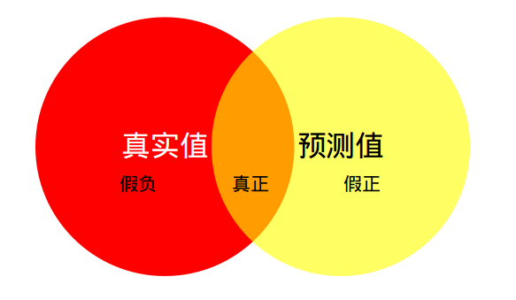
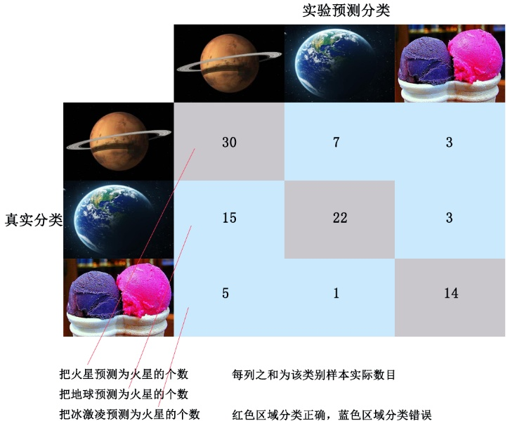

[TOC]

# 计算机视觉

## IoU

IoU（Intersection over Union），又称重叠度/交并比。

**1 NMS**：当在图像中预测多个proposals、pred bboxes时，由于预测的结果间可能存在高冗余（即同一个目标可能被预测多个矩形框），因此可以过滤掉一些彼此间高重合度的结果；具体操作就是根据各个bbox的score降序排序，剔除与高score bbox有较高重合度的低score bbox，那么重合度的度量指标就是IoU；

**2 mAP**：得到检测算法的预测结果后，需要对pred bbox与gt bbox一起评估检测算法的性能，涉及到的评估指标为mAP，那么当一个pred bbox与gt bbox的重合度较高（如IoU score > 0.5），且分类结果也正确时，就可以认为是该pred bbox预测正确，这里也同样涉及到IoU的概念；

提到IoU，大家都知道怎么回事，讲起来也都头头是道，我拿两个图示意下（以下两张图都不是本人绘制）：


绿框：gt bbox；

红框：pred bbox；

那么IoU的计算如下：


简单点说，就是**gt bbox、pred bbox交集的面积 / 二者并集的面积**；

好了，现在理解IoU的原理和计算方法了，就应该思考如何函数实现了，这也是我写本笔记的原因；

有次面试实习生的时候，一位同学讲各类目标检测算法头头是道，说到自己复现某某算法的mAP高达多少多少，问完他做的各种改进后，觉得小伙子还是挺不错的；

后来我是想着问问mAP的概念吧，但又觉得有点太复杂，不容易一下讲清楚细节，那就问问IoU吧，结果那位小朋友像傻逼一样看着我，说就是两个bbox的交并比啊，我说那要不你写段伪代码实现下吧，既然简单的话，应该实现起来还是很快的（一般我们也都会有这么个写伪代码的面试步骤，考考动手能力和思考能力吧）；然后那位自信满满的小伙子就立马下手开始写了，一般听完题目直接写代码的面试者，有两种可能性：

1 确实写过类似的代码，已经知道里面有哪些坑了，直接信手拈来；

2 没写过类似的代码，且把问题考虑简单化了；

我说你不用着急写，可以先想想两个bbox出现交集的各种情况，如两个bbox如何摆放，位置，以及二者不存在交集的情况等等（看到IoU的具体代码后，你会发现虽然只有寥寥几行代码，但其实已经处理好此类情况了），然后他画了几个图，瞬间表情严肃起来，然后我继续说你还得考虑一个bbox包围另一个bbox；两bbox并不是边角相交，而是两条边相交的特殊情况等等（说到这里我觉得自己也坏坏滴，故意把人家往歪路上牵。。。但主要是看得出来他确实不熟悉IoU的实现了），他就又画了若干种情况，最后开始写代码，刚开始还ok，写了十几行，后来越加越多，草稿纸上也涂涂改改越来越夸张，脸也越胀越红；我看了下他的代码，觉得他思路还行，考虑的还挺周全的，就给了他一个提示：你有没有考虑到你列举的这些情况，有一些可以合并的？他看了下，觉得是可以合并一些情况，就删减了部分代码，稿纸上就更乱了，然后又问他：可不可以继续合并；他就又继续思考了。。。大概是后来越想越复杂，就给我说这个原理他懂的，代码也看过，但现在确实是没能写出来；然后我安慰他，说如果没写过的话，确实是会把问题考虑简单化 / 复杂化，不过我并不是专门考个题目刁难你，而是因为你一直都在做目标检测，所以以为IoU的原理、实现你应该会比较熟悉的，写起代码也应该没问题的；而且你的思路也挺好的，先考虑各种复杂情况，再慢慢合并一些情况，先从1到N，再回到1就行，只不过可能到了N，没考虑到如何再回到1了；

再后来，也面试过其他实习生同学，问到了IoU的实现，很可惜，好像还没有一位同学能圆满写出来的。。。当然了，可能是我有时候过于抠细节了，不利于他们的发挥吧。。。

好了，以上都是废话，看看如何实现吧；

```python
# -*- coding: utf-8 -*-
#
# This is the python code for calculating bbox IoU,
# By running the script, we can get the IoU score between pred / gt bboxes
#
# Author: hzhumeng01 2018-10-19
# copyright @ netease, AI group

from __future__ import print_function, absolute_import
import numpy as np

def get_IoU(pred_bbox, gt_bbox):
    """
    return iou score between pred / gt bboxes
    :param pred_bbox: predict bbox coordinate
    :param gt_bbox: ground truth bbox coordinate
    :return: iou score
    """

    # bbox should be valid, actually we should add more judgements, just ignore here...
    # assert ((abs(pred_bbox[2] - pred_bbox[0]) > 0) and
    #         (abs(pred_bbox[3] - pred_bbox[1]) > 0))
    # assert ((abs(gt_bbox[2] - gt_bbox[0]) > 0) and
    #         (abs(gt_bbox[3] - gt_bbox[1]) > 0))

    # -----0---- get coordinates of inters
    ixmin = max(pred_bbox[0], gt_bbox[0])
    iymin = max(pred_bbox[1], gt_bbox[1])
    ixmax = min(pred_bbox[2], gt_bbox[2])
    iymax = min(pred_bbox[3], gt_bbox[3])
    iw = np.maximum(ixmax - ixmin + 1., 0.)
    ih = np.maximum(iymax - iymin + 1., 0.)

    # -----1----- intersection
    inters = iw * ih

    # -----2----- union, uni = S1 + S2 - inters
    uni = ((pred_bbox[2] - pred_bbox[0] + 1.) * (pred_bbox[3] - pred_bbox[1] + 1.) +
           (gt_bbox[2] - gt_bbox[0] + 1.) * (gt_bbox[3] - gt_bbox[1] + 1.) -
           inters)

    # -----3----- iou
    overlaps = inters / uni

    return overlaps


def get_max_IoU(pred_bboxes, gt_bbox):
    """
    given 1 gt bbox, >1 pred bboxes, return max iou score for the given gt bbox and pred_bboxes
    :param pred_bbox: predict bboxes coordinates, we need to find the max iou score with gt bbox for these pred bboxes
    :param gt_bbox: ground truth bbox coordinate
    :return: max iou score
    """

    # bbox should be valid, actually we should add more judgements, just ignore here...
    # assert ((abs(gt_bbox[2] - gt_bbox[0]) > 0) and
    #         (abs(gt_bbox[3] - gt_bbox[1]) > 0))

    if pred_bboxes.shape[0] > 0:
        # -----0---- get coordinates of inters, but with multiple predict bboxes
        ixmin = np.maximum(pred_bboxes[:, 0], gt_bbox[0])
        iymin = np.maximum(pred_bboxes[:, 1], gt_bbox[1])
        ixmax = np.minimum(pred_bboxes[:, 2], gt_bbox[2])
        iymax = np.minimum(pred_bboxes[:, 3], gt_bbox[3])
        iw = np.maximum(ixmax - ixmin + 1., 0.)
        ih = np.maximum(iymax - iymin + 1., 0.)

        # -----1----- intersection
        inters = iw * ih

        # -----2----- union, uni = S1 + S2 - inters
        uni = ((gt_bbox[2] - gt_bbox[0] + 1.) * (gt_bbox[3] - gt_bbox[1] + 1.) +
               (pred_bboxes[:, 2] - pred_bboxes[:, 0] + 1.) * (pred_bboxes[:, 3] - pred_bboxes[:, 1] + 1.) -
               inters)

        # -----3----- iou, get max score and max iou index
        overlaps = inters / uni
        ovmax = np.max(overlaps)
        jmax = np.argmax(overlaps)

    return overlaps, ovmax, jmax

if __name__ == "__main__":

    # test1
    pred_bbox = np.array([50, 50, 90, 100])   # top-left: <50, 50>, bottom-down: <90, 100>, <x-axis, y-axis>
    gt_bbox = np.array([70, 80, 120, 150])
    print (get_IoU(pred_bbox, gt_bbox))
    
    # test2
    pred_bboxes = np.array([[15, 18, 47, 60],
                          [50, 50, 90, 100],
                          [70, 80, 120, 145],
                          [130, 160, 250, 280],
                          [25.6, 66.1, 113.3, 147.8]])
    gt_bbox = np.array([70, 80, 120, 150])
    print (get_max_IoU(pred_bboxes, gt_bbox))
```

其实计算bbox间IoU唯一的难点就在计算intersection，代码的实现很简单：

```python
ixmin = max(pred_bbox[0], gt_bbox[0])
iymin = max(pred_bbox[1], gt_bbox[1])
ixmax = min(pred_bbox[2], gt_bbox[2])
iymax = min(pred_bbox[3], gt_bbox[3])
iw = np.maximum(ixmax - ixmin + 1., 0.)
ih = np.maximum(iymax - iymin + 1., 0.)
```

比较厉害的就是，以上短短六行代码就可以囊括所有pred bbox与gt bbox间的关系，不管是bboxes间相交 / 不相交，各种相交形式等等；我们在画图分析两个bbox间的关系时，会考虑各种情况，动手实践时会发现很复杂，是因为我们**陷入了一种先入为主的思维**，就是pred bbox与gt bbox有一个先后顺序，即我们认定了pred bbox为画图中的第一个bbox，gt bbox为第二个，这样在二者有不同位置关系时，就得考虑各种坐标判断情况，但若此时交换二者位置，其实并不影响我们计算IoU；

以上六行代码也印证了这个观点，直接计算两个bbox的相交边框坐标即可，若不相交得到的结果中，必有ixmax < ixmin、iymax - iymin其一成立，此时iw、ih就为0了；

好了，以上就是IoU的计算，原理比较简单，具体分析比较复杂，实现却异常简单，但通过对问题的深入分析，也能加深我们对知识的理解；

代码我传到github上了，比较简单：[IoU_demo.py](https://github.com/humengdoudou/object_detection_mAP/blob/master/IoU_demo.py)

**参考资料**

- [目标检测番外篇(1)_IoU](https://zhuanlan.zhihu.com/p/47189358)

- [目标检测之 IoU](<https://blog.csdn.net/u014061630/article/details/82818112>)

- [Detection基础模块之（一）IoU](https://zhuanlan.zhihu.com/p/70768666)

### 如何计算 mIoU？

Mean Intersection over Union(MIoU，均交并比)，为语义分割的标准度量。其计算两个集合的交集和并集之比，在语义分割问题中，这两个集合为真实值（ground truth）和预测值（predicted segmentation）。这个比例可以变形为TP（交集）比上TP、FP、FN之和（并集）。在每个类上计算IoU，然后取平均。
$$
MIoU=\frac{1}{k+1}\sum^{k}_{i=0}{\frac{p_{ii}}{\sum_{j=0}^{k}{p_{ij}+\sum_{j=0}^{k}{p_{ji}-p_{ii}}}}}
$$
pij表示真实值为i，被预测为j的数量。

**直观理解**



红色圆代表真实值，黄色圆代表预测值。橙色部分为两圆交集部分。

- MPA（Mean Pixel Accuracy，均像素精度）：计算橙色与红色圆的比例；
- MIoU：计算两圆交集（橙色部分）与两圆并集（红色+橙色+黄色）之间的比例，理想情况下两圆重合，比例为1。

**Tensorflow源码解析**

Tensorflow主要用`tf.metrics.mean_iou`来计算mIoU，下面解析源码：

**第一步：计算混淆矩阵**

混淆矩阵例子



```
# 主要代码
def confusion_matrix(labels, predictions, num_classes=None, dtype=dtypes.int32,
                     name=None, weights=None): 
    # 例子：labels =     [0, 1, 2, 0, 3]
    #      predictions =[0, 1, 1, 3, 3]
    if num_classes is None: # 不指定类别个数，就以labels或者predictions最大的指定,即4
      num_classes = math_ops.maximum(math_ops.reduce_max(predictions),
                                     math_ops.reduce_max(labels)) + 1 
    else:
      num_classes_int64 = math_ops.cast(num_classes, dtypes.int64)
      labels = control_flow_ops.with_dependencies(
          [check_ops.assert_less(
              labels, num_classes_int64, message='`labels` out of bound')],
          labels)
      predictions = control_flow_ops.with_dependencies(
          [check_ops.assert_less(
              predictions, num_classes_int64,
              message='`predictions` out of bound')],
          predictions)

    if weights is not None:
      predictions.get_shape().assert_is_compatible_with(weights.get_shape())
      weights = math_ops.cast(weights, dtype)

    shape = array_ops.stack([num_classes, num_classes])
    indices = array_ops.stack([labels, predictions], axis=1) 
    # indices = [[0,0],[1,1],[2,1],[0,3],[3,3]]
    values = (array_ops.ones_like(predictions, dtype)
              if weights is None else weights)
    # 对应位置的values，若不指定，则全为1
    cm_sparse = sparse_tensor.SparseTensor(
        indices=indices, values=values, dense_shape=math_ops.to_int64(shape))
    # 稀疏张量，指定indices位置为指定value，其他位置为0
    # 多次指定一个位置，value为多次相加的结果
    zero_matrix = array_ops.zeros(math_ops.to_int32(shape), dtype)

    return sparse_ops.sparse_add(zero_matrix, cm_sparse)
```

SparseTensor例子：

```python
import tensorflow as tf
a = tf.SparseTensor(indices=[[0,0], [1,2], [0, 0]], values=[1, 1, 1], dense_shape=[3, 4])
zero_m = array_ops.zeros(math_ops.to_int32([3,4]),dtype=tf.int32) 
r = sparse_ops.sparse_add(zero_m, a)
sess = tf.Session(config=tf.ConfigProto(device_count={'cpu':0}))
sess.run(r) 
# array([[2, 0, 0, 0],
#       [0, 0, 1, 0],
#       [0, 0, 0, 0]], dtype=int32)
```

**第二步：计算mIoU**

```python
def compute_mean_iou(total_cm, name):
  """Compute the mean intersection-over-union via the confusion matrix."""
  sum_over_row = math_ops.to_float(math_ops.reduce_sum(total_cm, 0))
  sum_over_col = math_ops.to_float(math_ops.reduce_sum(total_cm, 1))
  cm_diag = math_ops.to_float(array_ops.diag_part(total_cm)) # 交集
  denominator = sum_over_row + sum_over_col - cm_diag # 分母，即并集

  # The mean is only computed over classes that appear in the
  # label or prediction tensor. If the denominator is 0, we need to
  # ignore the class.
  num_valid_entries = math_ops.reduce_sum(
      math_ops.cast(
          math_ops.not_equal(denominator, 0), dtype=dtypes.float32)) # 类别个数

  # If the value of the denominator is 0, set it to 1 to avoid
  # zero division.
  denominator = array_ops.where(
      math_ops.greater(denominator, 0), denominator,
      array_ops.ones_like(denominator))
  iou = math_ops.div(cm_diag, denominator) # 各类IoU

  # If the number of valid entries is 0 (no classes) we return 0.
  result = array_ops.where(
      math_ops.greater(num_valid_entries, 0),
      math_ops.reduce_sum(iou, name=name) / num_valid_entries, 0) #mIoU
  return result
```

通过`tf.metrics.mean_iou`的API可以得到mIoU，但并没有把各类IoU释放出来，为了计算各类IoU，可以修改上面的代码，获取IoU中间结果，也可以用weight的方式变相计算。

基本思路就是把只保留一类的IoU，其他类IoU置零，然后最后将`mIoU * num_classes`就可以了。

```python
tp_position = tf.equal(tf.to_int32(labels), tf.to_int32(predictions))
label_0_weight = tf.where((tp_position & tf.not_equal(labels, 0)), tf.zeros_like(labels),
                                  tf.ones_like(labels))
## 混淆矩阵对角线上只保留一类非0，其他类都置0
metric_map['IOU/class_0_iou'] = tf.metrics.mean_iou(
            predictions, labels, dataset.num_classes, weights=label_0_weight)
## 结果是0类IoU/num_classes
```

**Pytorch源码解析**

Pytorch基本计算思路和上面是一样的，代码很简洁，就不过多介绍了。

```python
class IOUMetric:
    """
    Class to calculate mean-iou using fast_hist method
    """

    def __init__(self, num_classes):
        self.num_classes = num_classes
        self.hist = np.zeros((num_classes, num_classes))

    def _fast_hist(self, label_pred, label_true):
        mask = (label_true >= 0) & (label_true < self.num_classes)
        hist = np.bincount(
            self.num_classes * label_true[mask].astype(int) +
            label_pred[mask], minlength=self.num_classes ** 2).reshape(self.num_classes, self.num_classes)
        return hist

    def add_batch(self, predictions, gts):
        for lp, lt in zip(predictions, gts):
            self.hist += self._fast_hist(lp.flatten(), lt.flatten())

    def evaluate(self):
        acc = np.diag(self.hist).sum() / self.hist.sum()
        acc_cls = np.diag(self.hist) / self.hist.sum(axis=1)
        acc_cls = np.nanmean(acc_cls)
        iu = np.diag(self.hist) / (self.hist.sum(axis=1) + self.hist.sum(axis=0) - np.diag(self.hist))
        mean_iu = np.nanmean(iu)
        freq = self.hist.sum(axis=1) / self.hist.sum()
        fwavacc = (freq[freq > 0] * iu[freq > 0]).sum()
        return acc, acc_cls, iu, mean_iu, fwavacc
```

**Python 简版实现**

```python
#RT:RightTop
#LB:LeftBottom
def IOU(rectangle A, rectangleB):
    W = min(A.RT.x, B.RT.x) - max(A.LB.x, B.LB.x)
    H = min(A.RT.y, B.RT.y) - max(A.LB.y, B.LB.y)
    if W <= 0 or H <= 0:
        return 0;
    SA = (A.RT.x - A.LB.x) * (A.RT.y - A.LB.y)
    SB = (B.RT.x - B.LB.x) * (B.RT.y - B.LB.y)
    cross = W * H
    return cross/(SA + SB - cross)
```

**参考资料**

- <https://github.com/rafaelpadilla/Object-Detection-Metrics>
- [mIoU（平均交并比）计算代码与逐行解析](https://blog.csdn.net/jiongnima/article/details/84750819)
- <https://github.com/wasidennis/AdaptSegNet/blob/master/compute_iou.py>
- [mIoU源码解析](https://tianws.github.io/skill/2018/10/30/miou/)

## mAP

mAP定义及相关概念

- mAP: mean Average Precision, 即各类别AP的平均值
- AP: PR曲线下面积，后文会详细讲解
- PR曲线: Precision-Recall曲线
- Precision: TP / (TP + FP)
- Recall: TP / (TP + FN)
- TP: IoU>0.5的检测框数量（同一Ground Truth只计算一次）
- FP: IoU<=0.5的检测框，或者是检测到同一个GT的多余检测框的数量
- FN: 没有检测到的GT的数量

本笔记介绍目标检测的一个基本概念：AP、mAP（mean Average Precision），做目标检测的同学想必对这个词语耳熟能详了，不管是Pascal VOC，还是COCO，甚至是人脸检测的wider face数据集，都使用到了AP、mAP的评估方式，那么AP、mAP到底是什么？如何计算的？

如果希望一篇笔记讲明白目标检测中的mAP，感觉自己表达能力有限，可能搞不定，但如果希望一下能明白mAP含义的，可以参照引用链接；今天主要介绍下mAP的计算方式，假定前提为已经明白了precision、recall、tp、fp等概念，当然了，不明白也没关系，下一篇介绍Pascal VOC评估工具时会再详细介绍；

**1 图像检索mAP**

那么mAP到底是什么东西，如何计算？网上已经有了很多很多资料，但其实很多感觉都讲不清楚，我看到过一个在图像检索里面介绍得最好的示意图，我们先以图像检索中的mAP为例说明，其实目标检测中mAP与之几乎一样：


以上是图像检索中mAP的计算案例，简要说明下：

1 查询图片1在图像库中检索相似图像，假设图像库中有五张相似图像，表示为图片1、...、图片5，排名不分先后；

2 检索（过程略），返回了top-10图像，如上图第二行，橙色表示相似的图像，灰色为无关图像；

3 接下来就是precision、recall的计算过程了，结合上图比较容易理解；

以返回图片6的节点为例：

top-6中，有3张图像确实为相似图像，另三张图像为无关图像，因此precision = 3 / 6；同时，总共五张相似图像，top-6检索出来了三张，因此recall = 3 / 5；

4 然后计算AP，可以看右边的计算方式，可以发现是把列出来的查询率(precision)相加取平均，那么最关键的问题来了：为什么选择这几张图像的precision求平均？可惜图中并没有告诉我们原因；

但其实不难，一句话就是：**选择每个recall区间内对应的最高precision**；

举个栗子，以上图橙色检索案例为例，当我们只选择top-1作为检索结果返回（也即只返回一个检索结果）时，检索性能为：

```text
top-1：recall = 1 / 5、precision = 1 / 1；# 以下类推；
top-2：recall = 1 / 5、precision = 1 / 2；
top-3：recall = 2 / 5、precision = 2 / 3；
top-4：recall = 2 / 5、precision = 2 / 4；
top-5：recall = 2 / 5、precision = 2 / 5；
top-6：recall = 3 / 5、precision = 3 / 6；
top-7：recall = 3 / 5、precision = 3 / 7；
top-8：recall = 3 / 5、precision = 3 / 8；
top-9：recall = 4 / 5、precision = 4 / 9；
top-10：recall = 5 / 5、precision = 5 / 10；
```

结合上面清单，先找找recall = 1 / 5区间下的最高precision，对应着precision = 1 / 1；

同理，recall = 2 / 5区间下的最高precision，对应着precision = 2 / 3；

recall = 3 / 5区间下的最高precision，对应着precision = 3 / 6；依次类推；

这样AP = (1 / 1 + 2 / 3 + 3 / 6 + 4 / 9 + 5 / 10) / 5；

那么mAP是啥？计算所有检索图像返回的AP均值，对应上图就是橙、绿突图像计算AP求均值，对应红色框；

这样mAP就计算完毕啦~~~是不是很容易理解？目标检测的mAP也是类似操作了；

**2 目标检测中mAP计算流程**

这里面我引用的是一篇博文，以下内容大多参考该博文，做了一些小修改；

下面的例子也很容易理解，假设检测人脸吧，gt label表示1为人脸，0为bg，某张图像中共检出了20个pred bbox，id：1 ~ 20，并对应了confidence score，gt label也很容易获得，pred bbox与gt bbox算IoU，给定一个threshold，那么就**知道该pred bbox是否为正确的预测结果了，就对应了其gt label**；---- 其实下表不应该这么理解的，但我们还是先这么认为，忽略差异吧，先直捣黄龙，table 1：


接下来对confidence score排序，得到table 2：


*这张表很重要，接下来的precision和recall都是依照这个表计算的，那么这里的confidence score其实就和图像检索中的相似度关联上了，具体地，就是如第一节的图像检索中，虽然我们计算mAP没在乎其检索返回的先后顺序，但top1肯定是与待检索图像最相似的，对应的similarity score最高，对人脸检测而言，pred bbox的confidence score最高，也说明该bbox最有可能是人脸；*

然后计算precision和recall，这两个标准的定义如下：


上面的图看看就行，能理解就理解，不理解可以参照第一节图像检索的例子来理解；

现以返回的top-5结果为例，如table 3：


在这个例子中，true positives就是指id = 4、2的pred bbox，false positives就是指id = 13、19、6的pred bbox。方框内圆圈外的元素（false negatives + true negatives）是相对于方框内的元素而言，在这个例子中，是指confidence score排在top-5之外的元素，即table 4：


其中，false negatives是指id = 9、16、7、20的4个pred bbox，true negatives是指id = 1、18、5、15、10、17、12、14、8、11、3的11个pred bbox；

那么，这个例子中Precision = 2 / 5 = 40%，意思是对于人脸检测而言，我们选定了5 pred bbox，其中正确的有2个，即准确率为40%；Recall = 2 / 6 = 33%，意思是该图像中共有6个人脸，但是因为我们只召回了2个，所以召回率为33%；

实际的目标检测任务中，我们通常不满足只通过top-5来衡量一个模型的好坏，而是需要知道从top-1到top-N（N是所有pred bbox，本文中为20）对应的precision和recall；显然随着我们选定的pred bbox越来也多，recall一定会越来越高，而precision整体上会呈下降趋势；把recall当成横坐标，precision当成纵坐标，即可得到常用的precision-recall曲线，以上例子的precision-recall曲线如fig 1：


以上图像如何计算的？可以参照第一节图像检索中的栗子，还是比较容易理解的吧；

上面的每个红点，就相当于根据table 2，按照第一节中图像检索的方式计算出来的，也可以直接参照下面的table 5，自己心里算一算；

那么按照**选择每个recall区间内对应的最高precision**的计算方案，各个recall区间内对应的top-precision，就刚好如fig 1中的绿色框位置，可以进一步结合table 5中的绿色框理解；

好了，那么对这张图像而言，其AP = （1 / 1 + 2 / 2 + 3 / 6 + 4 / 7 + 5 / 11 + 6 / 16）/ 6；这是针对单张图像而言，所有图像也类似方式计算，那么就可以根据所有图像上的pred bbox，采用同样的方式，就计算出了所有图像上人脸这个类的AP；因为人脸检测只有一个类，如Pascal VOC这种20类的，每类都可以计算出一个AP，那么AP_total / 20，就是mAP啦；

但是等等，有没有发现table 5中，计算方式好像跟我们讲的有一点不一样？我们继续看看；

**3 Pascal VOC的两套mAP评估标准**

Pascal VOC中对mAP的计算经历了两次迭代，一种是VOC07的计算标准，对应绿色框：

首先设定一组阈值，T = [0、0.1、0.2、…、1]，然后对于recall大于每一个阈值Ti（比如recall > 0.3），我们都会在该recall区间内得到一个对应的最大precision，这样我们就计算出了11个precision；----- 这里与上两节介绍的概念是一样的，只不过上面recall的区间是参照gt label来划分的，这里是我们人为划分的11个节点；

AP即为这11个precision的平均值，这种方法英文叫做11-point interpolated average precision；有了一个类的AP，所有类的AP均值即为mAP；

另一种是VOC10的计算标准，对应白色框：

新的计算方法假设N个pred bbox中有M个gt bbox，那么我们会得到M个recall节点（1 / M、2 / M、...、 M / M），对于**每个recall值 r，我们可以计算出对应（r' > r）的最大precision，然后对这M个precision值取平均即得到最后的AP值**，计算方法如table 5：


从VOC07的绿框、VOC10的白框对比可知，差异主要在recall = 3 / 6下的precision，可以发现VOC07找的top-precision是在该recall区间段内的，但**VOC10相当于是向后查找的，需确保该recall阈值以后的区间内，对应的是top-precision**，可知4 / 7 > 3 / 6，因此使用4 / 7替换了3 / 6，其他recall阈值下的操作方式类似；

**那么代码的实操中，就得从按照recall阈值从后往前计算了，这样就可以一遍就梭哈出所有结果，如果按recall从前往后计算，就有很多重复性计算（不断地重复向后recall区间内查找top-precision），然后呢，就可以使用到动态规划的方式做了，理论结合实践啊有木有~~~**

那么VOC10下，相应的Precision-Recall曲线如fig 2，可以发现这条曲线是单调递减的，剩下的AP计算方式就与VOC07相同了：

这里还需要继续一点，**VOC07是11点插值的AP方式，等于是卡了11个离散的点，划分10个区间来计算AP**，但VOC10是是**根据recall值变化的区间来计算的**，在这个栗子里，recall只变化了6次，但如果recall变化很多次，如100次、1000次、9999次等，就可以认为是**一种 “伪” 连续的方式计算**了；


**总结**：

AP衡量的是模型在每个类别上的好坏，mAP衡量的是模型在所有类别上的好坏，得到AP后mAP的计算就变得很简单了，就是取所有类别AP的平均值。

**3 代码**

直接上代码吧，这个函数假设我们已经得到了排序好的precision、recall的list，对应上图fig 2，进一步可以参照第一节中的清单理解；

```python
# VOC-style mAP，分为两个计算方式，之所有两个计算方式，是因为2010年后VOC更新了评估方法，因此就有了07-metric和else...
def voc_ap(rec, prec, use_07_metric=False):
    """
    average precision calculations
    [precision integrated to recall]
    :param rec: recall list
    :param prec: precision list
    :param use_07_metric: 2007 metric is 11-recall-point based AP
    :return: average precision
    """
    if use_07_metric:
        # 11 point metric
        ap = 0.
        # VOC07是11点插值的AP方式，等于是卡了11个离散的点，划分10个区间来计算AP
        for t in np.arange(0., 1.1, 0.1):
            if np.sum(rec >= t) == 0:
                p = 0    # recall卡的阈值到顶了，1.1
            else:
                p = np.max(prec[rec >= t])   # VOC07：选择每个recall区间内对应的最高precision的计算方案
            ap = ap + p / 11.    # 11-recall-point based AP
    else:
        # correct AP calculation
        # first append sentinel values at the end
        mrec = np.concatenate(([0.], rec, [1.]))
        mpre = np.concatenate(([0.], prec, [0.]))

        # compute the precision envelope
        for i in range(mpre.size - 1, 0, -1):
            mpre[i - 1] = np.maximum(mpre[i - 1], mpre[i])    # 这个是不是动态规划？从后往前找之前区间内的top-precision，多么优雅的代码呀~~~

        # to calculate area under PR curve, look for points where X axis (recall) changes value
        # 上面的英文，可以结合着fig 2的绿框理解，一目了然
        # VOC10是是根据recall值变化的区间来计算的，如果recall变化很多次，就可以认为是一种 “伪” 连续的方式计算了，以下求的是recall的变化
        i = np.where(mrec[1:] != mrec[:-1])[0]

        # 计算AP，这个计算方式有点玄乎，是一个积分公式的简化，应该是对应的fig 2中红色曲线以下的面积，之前公式的推导我有看过，现在有点忘了，麻烦各位同学补充一下
        # 现在理解了，不难，公式：sum (\Delta recall) * prec，其实结合fig2和下面的图，不就是算的积分么？如果recall划分得足够细，就可以当做连续数据，然后以下公式就是积分公式，算的precision、recall下面的面积了
        ap = np.sum((mrec[i + 1] - mrec[i]) * mpre[i + 1])
    return ap
```


通常VOC10标准下计算的mAP值会高于VOC07，原因如下，我就不详细介绍了：

> **Interpolated average precision**
> Some authors choose an alternate approximation that is called the *interpolated average precision*. Often, they still call it average precision. Instead of using *P(k)*, the precision at a retrieval cutoff of *k* images, the interpolated average precision uses:


> In other words, instead of using the precision that was actually observed at cutoff *k*, the interpolated average precision uses the maximum precision observed across all cutoffs with higher recall. The full equation for computing the interpolated average precision is:


> Visually, here’s how the interpolated average precision compares to the approximated average precision (to show a more interesting plot, this one isn’t from the earlier example):


> *The approximated average precision closely hugs the actually observed curve. The interpolated average precision over estimates the precision at many points and produces a higher average precision value than the approximated average precision.*
>
> Further, there are variations on where to take the samples when computing the interpolated average precision. Some take samples at a fixed 11 points from 0 to 1: {0, 0.1, 0.2, …, 0.9, 1.0}. This is called the 11-point interpolated average precision. Others sample at every *k* where the recall changes.

**参考资料**

- [目标检测番外篇(2)_mAP](https://zhuanlan.zhihu.com/p/48992451)
- [目标检测中的mAP是什么含义？](https://www.zhihu.com/question/53405779)
- [Object-Detection-Metrics](https://github.com/rafaelpadilla/Object-Detection-Metrics)
- [【目标检测】VOC mAP](https://zhuanlan.zhihu.com/p/67279824)
- [白话mAP](https://zhuanlan.zhihu.com/p/60834912)
- [Detection基础模块之（二）mAP](https://zhuanlan.zhihu.com/p/60319755)

### 如何计算 mAP？

- [ ] TODO

**参考资料**

- https://github.com/Cartucho/mAP
- <https://github.com/rafaelpadilla/Object-Detection-Metrics>
- [【目标检测】VOC mAP](https://zhuanlan.zhihu.com/p/67279824)

## 目标检测度量标准

- mAP
- FPS

- [ ] TODO

**参考资料**

- [Object-Detection-Metrics](https://github.com/rafaelpadilla/Object-Detection-Metrics)
- [目标检测的性能评价指标](https://zhuanlan.zhihu.com/p/70306015)
- [【目标检测】基础知识：IoU、NMS、Bounding box regression](https://zhuanlan.zhihu.com/p/60794316)

## 图像分割度量标准

- [ ] TODO
- PA
- MP
- mIoU
- FWIoU

**参考资料**

- [《A Review on Deep Learning Techniques Applied to Semantic Segmentation》](https://arxiv.org/abs/1704.06857)
- [图像语义分割准确率度量方法总结](https://zhuanlan.zhihu.com/p/38236530)
- [论文笔记 |　基于深度学习的图像语义分割技术概述之5.1度量标准](https://blog.csdn.net/u014593748/article/details/71698246)

## 非极大值抑制NMS

- [ ] TODO

## 目标检测中的Anchor

- [ ] 

**参考资料**

- [目标检测中的Anchor](https://zhuanlan.zhihu.com/p/55824651)

## 原始图片中的ROI如何映射到到feature map?

- [ ] TODO

**参考资料**

- https://zhuanlan.zhihu.com/p/24780433
- http://www.cnblogs.com/objectDetect/p/5947169.html

## 请问Faster R-CNN和SSD 中为什么用smooth l1 loss，和l2有什么区别？

- [ ] 

**参考资料**

- [请问faster rcnn和ssd 中为什么用smooth l1 loss，和l2有什么区别？](https://www.zhihu.com/question/58200555/answer/621174180)

## 给定5个人脸关键点和5个对齐后的点，求怎么变换的？

- [ ] TODO

## Bounding boxes 回归原理/公式

- [ ] TODO

## U-Net 和 FCN的区别

- [ ] TODO


## 介绍KCF算法

- [ ] TODO


## 介绍MobileNet-SSD算法

- [ ] TODO


## 目标检测中的多尺度训练/测试？

- [ ] TODO


多尺度训练对全卷积网络有效，一般设置几种不同尺度的图片，训练时每隔一定iterations随机选取一种尺度训练。这样训练出来的模型鲁棒性强，其可以接受任意大小的图片作为输入，使用尺度小的图片测试速度会快些，但准确度低，用尺度大的图片测试速度慢，但是准确度高。

**参考资料**

- [目标检测中的多尺度训练/测试？](https://www.zhihu.com/question/271781123)

## 目标检测中的正负样本不平衡问题

- [OHEM](https://arxiv.org/abs/1604.03540)
- [Focal Loss](https://arxiv.org/abs/1708.02002)
- [GHM](https://arxiv.org/abs/1811.05181)
- [PISA](https://arxiv.org/abs/1904.04821)
- [AP-loss](https://arxiv.org/abs/1904.06373)

**参考资料**

- [样本贡献不均：Focal Loss和 Gradient Harmonizing Mechanism](https://zhuanlan.zhihu.com/p/55036597)
- [被忽略的Focal Loss变种](https://zhuanlan.zhihu.com/p/62314673)
- [Soft Sampling：探索更有效的采样策略](https://zhuanlan.zhihu.com/p/63954517)：介绍了**Focal Loss**、**GHM**和**PISA**

## 目标检测中的类别漏检问题该怎么解决？

- [ ] TODO

**参考资料**

- [目标检测中的类别漏检问题该怎么解决？](https://www.zhihu.com/question/372208101)

## RPN

### RPN 的损失函数

- [ ] TODO

### RPN中的anchor box是怎么选取的？

- [ ] TODO

## RoI Pooling

- [ ] TODO

**参考资料**

- [你真的学会RoI Pooling了吗?](https://zhuanlan.zhihu.com/p/59692298)
- [IoUNet(5)源码 RoIPooling(1)](https://zhuanlan.zhihu.com/p/46927880)  

## RoI Align

- [ ] TODO

**参考资料**

- [IoUNet(6) 源码 RoIAlign(1)](https://zhuanlan.zhihu.com/p/46928697)

## 为什么深度学习中的图像分割要先编码再解码？

- [ ] TODO

**参考资料**

- [为什么深度学习中的图像分割要先编码再解码？](https://www.zhihu.com/question/322191738)


## NMS

本笔记介绍目标检测的另一个基本概念：NMS（non-maximum suppression），做目标检测的同学想必对这个词语耳熟能详了；

在检测图像中的目标时，不可避免地会检出很多bboxes + cls scores，这些bbox之间有很多是冗余的，一个目标可能会被多个bboxes检出，如果所有bboxes都输出，就很影响体验和美观了（同一个目标输出100个bboxes，想想都后怕~~~），一种方案就是提升cls scores的阈值，减少bbox数量的输出；另一种方案就是使用NMS，将同一目标内的bboxes按照cls score + IoU阈值做筛选，剔除冗余地、低置信度的bbox；

可能又会问了：为什么目标检测时，会有这么多无效、冗余检测框呢？这个。。。我的理解，是因为图像中没有目标尺度、位置的先验知识，为保证对目标的高召回，就必须使用滑窗、anchor / default bbox密集采样的方式，尽管检测模型能对每个anchor / default bbox做出 cls + reg，可以一定程度上剔除误检，但没有结合检出bbox的cls score + IoU阈值做筛选，而NMS就可以做到这一点；

**1 NMS操作流程**

NMS用于剔除图像中检出的冗余bbox，标准NMS的具体做法为：

**step-1**：将所有检出的output_bbox按cls score划分（如pascal voc分20个类，也即将output_bbox按照其对应的cls score划分为21个集合，1个bg类，只不过bg类就没必要做NMS而已）；

**step-2**：在每个集合内根据各个bbox的cls score做降序排列，得到一个降序的list_k；

**step-3**：从list_k中top1 cls score开始，计算该bbox_x与list中其他bbox_y的IoU，若IoU大于阈值T，则剔除该bbox_y，最终保留bbox_x，从list_k中取出；

**step-4**：选择list_k中top2 cls score(步骤3取出top 1 bbox_x后，原list_k中的top 2就相当于现list_k中的top 1了，但如果step-3中剔除的bbox_y刚好是原list_k中的top 2，就依次找top 3即可，理解这么个意思就行)，重复step-3中的迭代操作，直至list_k中所有bbox都完成筛选；

**step-5**：对每个集合的list_k，重复step-3、4中的迭代操作，直至所有list_k都完成筛选；

以上操作写的有点绕，不过如果理解NMS操作流程的话，再结合下图，应该还是非常好理解的；


**2 代码学习**

**2.1 test_RFB.py**

我选择了RFBNet里的代码介绍NMS，因为里面的流程基本上就是按照我说的操作进行了；

先看看test_RFB.py中的片段，通过以下代码可以发现，其对应着step-1、step5操作，就是说NMS操作是逐类进行的，图像中检出的所有bboxes，按照 cls 做划分，再每个类的bbox进一步做NMS；

```python
out = net(x)      # forward pass，这里相当于将图像 x 输入RFBNet，得到了pred cls + reg
boxes, scores = detector.forward(out,priors) # 结合priors，将pred reg（也即预测的offsets）解码成最终的pred bbox，如果理解anchor / default bbox操作流程，这个应该很好理解的；
boxes = boxes[0]
scores=scores[0]

# scale each detection back up to the image
boxes *= scale   # （0，1）区间坐标的bbox做尺度反正则化
boxes = boxes.cpu().numpy()
scores = scores.cpu().numpy()

for j in range(1, num_classes):      # 对每个类 j 的pred bbox单独做NMS，为什么index从1开始？因为0是bg，做NMS无意义
    inds = np.where(scores[:, j] > thresh)[0]     # 找到该类 j 下，所有cls score大于thresh的bbox，为什么选择大于thresh的bbox？因为score小于阈值的bbox，直接可以过滤掉，无需劳烦NMS
    if len(inds) == 0:    # 没有满足条件的bbox，返回空，跳过；
        all_boxes[j][i] = np.empty([0, 5], dtype=np.float32)
        continue
    c_bboxes = boxes[inds]
    c_scores = scores[inds, j]   # 找到对应类 j 下的score即可
    c_dets = np.hstack((c_bboxes, c_scores[:, np.newaxis])).astype(
        np.float32, copy=False)   # 将满足条件的bbox + cls score的bbox通过hstack完成合体

    keep = nms(c_dets, 0.45, force_cpu=args.cpu)    # NMS，返回需保存的bbox index：keep
    c_dets = c_dets[keep, :]
    all_boxes[j][i] = c_dets     # i 对应每张图像，j 对应图像中类别 j 的bbox清单
```

介绍以上代码处理流程，**两个目的**：

1 test_RFB.py的处理流程非常清晰，也很方便我们的理解；

2 for j in range(1, num_classes)操作表明了，NMS是逐类进行的，也即参与NMS的bbox都属于同一类；


**2.2 py_cpu_nms.py**

代码同样来自于FRBNet，结合注释可以发现引自Fast R-CNN；

这个代码是最简版的nms，跟第一节中NMS处理流程一致，非常适合学习，可以作为baseline，我加了个简单的main函数做测试；

```python
# --------------------------------------------------------
# Fast R-CNN
# Copyright (c) 2015 Microsoft
# Licensed under The MIT License [see LICENSE for details]
# Written by Ross Girshick
# --------------------------------------------------------

import numpy as np

def py_cpu_nms(dets, thresh):
    """Pure Python NMS baseline."""
    x1 = dets[:, 0]                     # pred bbox top_x
    y1 = dets[:, 1]                     # pred bbox top_y
    x2 = dets[:, 2]                     # pred bbox bottom_x
    y2 = dets[:, 3]                     # pred bbox bottom_y
    scores = dets[:, 4]              # pred bbox cls score

    areas = (x2 - x1 + 1) * (y2 - y1 + 1)    # pred bbox areas
    order = scores.argsort()[::-1]              # 对pred bbox按score做降序排序，对应step-2

    keep = []    # NMS后，保留的pred bbox
    while order.size > 0:
        i = order[0]          # top-1 score bbox
        keep.append(i)   # top-1 score的话，自然就保留了
        xx1 = np.maximum(x1[i], x1[order[1:]])   # top-1 bbox（score最大）与order中剩余bbox计算NMS
        yy1 = np.maximum(y1[i], y1[order[1:]])
        xx2 = np.minimum(x2[i], x2[order[1:]])
        yy2 = np.minimum(y2[i], y2[order[1:]])

        w = np.maximum(0.0, xx2 - xx1 + 1)
        h = np.maximum(0.0, yy2 - yy1 + 1)
        inter = w * h
        ovr = inter / (areas[i] + areas[order[1:]] - inter)      # 无处不在的IoU计算~~~

        inds = np.where(ovr <= thresh)[0]     # 这个操作可以对代码断点调试理解下，结合step-3，我们希望剔除所有与当前top-1 bbox IoU > thresh的冗余bbox，那么保留下来的bbox，自然就是ovr <= thresh的非冗余bbox，其inds保留下来，作进一步筛选
        order = order[inds + 1]   # 保留有效bbox，就是这轮NMS未被抑制掉的幸运儿，为什么 + 1？因为ind = 0就是这轮NMS的top-1，剩余有效bbox在IoU计算中与top-1做的计算，inds对应回原数组，自然要做 +1 的映射，接下来就是step-4的循环

    return keep    # 最终NMS结果返回

if __name__ == '__main__':
    dets = np.array([[100,120,170,200,0.98],
                     [20,40,80,90,0.99],
                     [20,38,82,88,0.96],
                     [200,380,282,488,0.9],
                     [19,38,75,91, 0.8]])

    py_cpu_nms(dets, 0.5)
```


**2.2 bbox_utils.py**

同样是RFBNet中的nms代码，用pytorch实现的，其实和2.1小节中的NMS操作完全一致；

```python
# Original author: Francisco Massa:
# https://github.com/fmassa/object-detection.torch
# Ported to PyTorch by Max deGroot (02/01/2017)
def nms(boxes, scores, overlap=0.5, top_k=200):
    """Apply non-maximum suppression at test time to avoid detecting too many
    overlapping bounding boxes for a given object. ---- 这里面有一个细节，NMS仅用于测试阶段，为什么不用于训练阶段呢？可以评论留言下，我就不解释了，嘿嘿~~~
    Args:
        boxes: (tensor) The location preds for the img, Shape: [num_priors,4].
        scores: (tensor) The class predscores for the img, Shape:[num_priors].
        overlap: (float) The overlap thresh for suppressing unnecessary boxes.
        top_k: (int) The Maximum number of box preds to consider.
    Return:
        The indices of the kept boxes with respect to num_priors.
    """

    keep = torch.Tensor(scores.size(0)).fill_(0).long()
    if boxes.numel() == 0:
        return keep
    x1 = boxes[:, 0]
    y1 = boxes[:, 1]
    x2 = boxes[:, 2]
    y2 = boxes[:, 3]
    area = torch.mul(x2 - x1, y2 - y1)    # IoU初步准备
    v, idx = scores.sort(0)  # sort in ascending order，对应step-2，不过是升序操作，非降序
    # I = I[v >= 0.01]
    idx = idx[-top_k:]  # indices of the top-k largest vals，依然是升序的结果
    xx1 = boxes.new()
    yy1 = boxes.new()
    xx2 = boxes.new()
    yy2 = boxes.new()
    w = boxes.new()
    h = boxes.new()

    # keep = torch.Tensor()
    count = 0
    while idx.numel() > 0:   # 对应step-4，若所有pred bbox都处理完毕，就可以结束循环啦~
        i = idx[-1]  # index of current largest val，top-1 score box，因为是升序的，所有返回index = -1的最后一个元素即可
        # keep.append(i)
        keep[count] = i
        count += 1    # 不仅记数NMS保留的bbox个数，也作为index存储bbox
        if idx.size(0) == 1:
            break
        idx = idx[:-1]  # remove kept element from view，top-1已保存，不需要了~~~
        # load bboxes of next highest vals
        torch.index_select(x1, 0, idx, out=xx1)
        torch.index_select(y1, 0, idx, out=yy1)
        torch.index_select(x2, 0, idx, out=xx2)
        torch.index_select(y2, 0, idx, out=yy2)
        # store element-wise max with next highest score
        xx1 = torch.clamp(xx1, min=x1[i])   # 对应 np.maximum(x1[i], x1[order[1:]]) 
        yy1 = torch.clamp(yy1, min=y1[i])
        xx2 = torch.clamp(xx2, max=x2[i])
        yy2 = torch.clamp(yy2, max=y2[i])
        w.resize_as_(xx2)
        h.resize_as_(yy2)
        w = xx2 - xx1
        h = yy2 - yy1
        # check sizes of xx1 and xx2.. after each iteration
        w = torch.clamp(w, min=0.0)    # clamp函数可以去查查，类似max、mini的操作
        h = torch.clamp(h, min=0.0)
        inter = w*h
        # IoU = i / (area(a) + area(b) - i)     
        # 以下两步操作做了个优化，area已经计算好了，就可以直接根据idx读取结果了，area[i]同理，避免了不必要的冗余计算
        rem_areas = torch.index_select(area, 0, idx)  # load remaining areas)
        union = (rem_areas - inter) + area[i]     # 就是area(a) + area(b) - i
        IoU = inter/union  # store result in iou，# IoU来啦~~~
        # keep only elements with an IoU <= overlap
        idx = idx[IoU.le(overlap)]   # 这一轮NMS操作，IoU阈值小于overlap的idx，就是需要保留的bbox，其他的就直接忽略吧，并进行下一轮计算
    return keep, count
```

**2.2 cpu_nms.pyx**

同样在RGBNet项目中，下面就是优化后的NNS操作，以及soft-NMS操作，我就不细讲了~~~

```python
# --------------------------------------------------------
# Fast R-CNN
# Copyright (c) 2015 Microsoft
# Licensed under The MIT License [see LICENSE for details]
# Written by Ross Girshick
# --------------------------------------------------------

import numpy as np
cimport numpy as np

cdef inline np.float32_t max(np.float32_t a, np.float32_t b):
    return a if a >= b else b

cdef inline np.float32_t min(np.float32_t a, np.float32_t b):
    return a if a <= b else b

def cpu_nms(np.ndarray[np.float32_t, ndim=2] dets, np.float thresh):
    cdef np.ndarray[np.float32_t, ndim=1] x1 = dets[:, 0]
    cdef np.ndarray[np.float32_t, ndim=1] y1 = dets[:, 1]
    cdef np.ndarray[np.float32_t, ndim=1] x2 = dets[:, 2]
    cdef np.ndarray[np.float32_t, ndim=1] y2 = dets[:, 3]
    cdef np.ndarray[np.float32_t, ndim=1] scores = dets[:, 4]

    cdef np.ndarray[np.float32_t, ndim=1] areas = (x2 - x1 + 1) * (y2 - y1 + 1)
    cdef np.ndarray[np.int_t, ndim=1] order = scores.argsort()[::-1]

    cdef int ndets = dets.shape[0]
    cdef np.ndarray[np.int_t, ndim=1] suppressed = \
            np.zeros((ndets), dtype=np.int)

    # nominal indices
    cdef int _i, _j
    # sorted indices
    cdef int i, j
    # temp variables for box i's (the box currently under consideration)
    cdef np.float32_t ix1, iy1, ix2, iy2, iarea
    # variables for computing overlap with box j (lower scoring box)
    cdef np.float32_t xx1, yy1, xx2, yy2
    cdef np.float32_t w, h
    cdef np.float32_t inter, ovr

    keep = []
    for _i in range(ndets):
        i = order[_i]
        if suppressed[i] == 1:
            continue
        keep.append(i)
        ix1 = x1[i]
        iy1 = y1[i]
        ix2 = x2[i]
        iy2 = y2[i]
        iarea = areas[i]
        for _j in range(_i + 1, ndets):
            j = order[_j]
            if suppressed[j] == 1:
                continue
            xx1 = max(ix1, x1[j])
            yy1 = max(iy1, y1[j])
            xx2 = min(ix2, x2[j])
            yy2 = min(iy2, y2[j])
            w = max(0.0, xx2 - xx1 + 1)
            h = max(0.0, yy2 - yy1 + 1)
            inter = w * h
            ovr = inter / (iarea + areas[j] - inter)
            if ovr >= thresh:
                suppressed[j] = 1

    return keep

def cpu_soft_nms(np.ndarray[float, ndim=2] boxes, float sigma=0.5, float Nt=0.3, float threshold=0.001, unsigned int method=0):
    cdef unsigned int N = boxes.shape[0]
    cdef float iw, ih, box_area
    cdef float ua
    cdef int pos = 0
    cdef float maxscore = 0
    cdef int maxpos = 0
    cdef float x1,x2,y1,y2,tx1,tx2,ty1,ty2,ts,area,weight,ov

    for i in range(N):
        maxscore = boxes[i, 4]
        maxpos = i

        tx1 = boxes[i,0]
        ty1 = boxes[i,1]
        tx2 = boxes[i,2]
        ty2 = boxes[i,3]
        ts = boxes[i,4]

        pos = i + 1
	# get max box
        while pos < N:
            if maxscore < boxes[pos, 4]:
                maxscore = boxes[pos, 4]
                maxpos = pos
            pos = pos + 1

	# add max box as a detection 
        boxes[i,0] = boxes[maxpos,0]
        boxes[i,1] = boxes[maxpos,1]
        boxes[i,2] = boxes[maxpos,2]
        boxes[i,3] = boxes[maxpos,3]
        boxes[i,4] = boxes[maxpos,4]

	# swap ith box with position of max box
        boxes[maxpos,0] = tx1
        boxes[maxpos,1] = ty1
        boxes[maxpos,2] = tx2
        boxes[maxpos,3] = ty2
        boxes[maxpos,4] = ts

        tx1 = boxes[i,0]
        ty1 = boxes[i,1]
        tx2 = boxes[i,2]
        ty2 = boxes[i,3]
        ts = boxes[i,4]

        pos = i + 1
	# NMS iterations, note that N changes if detection boxes fall below threshold
        while pos < N:
            x1 = boxes[pos, 0]
            y1 = boxes[pos, 1]
            x2 = boxes[pos, 2]
            y2 = boxes[pos, 3]
            s = boxes[pos, 4]

            area = (x2 - x1 + 1) * (y2 - y1 + 1)
            iw = (min(tx2, x2) - max(tx1, x1) + 1)
            if iw > 0:
                ih = (min(ty2, y2) - max(ty1, y1) + 1)
                if ih > 0:
                    ua = float((tx2 - tx1 + 1) * (ty2 - ty1 + 1) + area - iw * ih)
                    ov = iw * ih / ua #iou between max box and detection box

                    if method == 1: # linear
                        if ov > Nt: 
                            weight = 1 - ov
                        else:
                            weight = 1
                    elif method == 2: # gaussian
                        weight = np.exp(-(ov * ov)/sigma)
                    else: # original NMS
                        if ov > Nt: 
                            weight = 0
                        else:
                            weight = 1

                    boxes[pos, 4] = weight*boxes[pos, 4]
		    
		    # if box score falls below threshold, discard the box by swapping with last box
		    # update N
                    if boxes[pos, 4] < threshold:
                        boxes[pos,0] = boxes[N-1, 0]
                        boxes[pos,1] = boxes[N-1, 1]
                        boxes[pos,2] = boxes[N-1, 2]
                        boxes[pos,3] = boxes[N-1, 3]
                        boxes[pos,4] = boxes[N-1, 4]
                        N = N - 1
                        pos = pos - 1

            pos = pos + 1

    keep = [i for i in range(N)]
    return keep
```

**参考代码：**

[https://github.com/ruinmessi/RFBNet](https://link.zhihu.com/?target=https%3A//github.com/ruinmessi/RFBNet)：RFBNet

[https://github.com/rbgirshick/py-faster-rcnn](https://link.zhihu.com/?target=https%3A//github.com/rbgirshick/py-faster-rcnn)：学习一百遍都不为过的faster rcnn

NMS_demo.py：<https://github.com/humengdoudou/object_detection_mAP/blob/master/NMS_demo.py>

**参考资料**

- [目标检测番外篇(3)_NMS](https://zhuanlan.zhihu.com/p/49481833)
- [浅谈NMS的多种实现](https://zhuanlan.zhihu.com/p/64423753)

## NMS及其变体

- NMS

- Soft-NMS
- Softer-NMS
- IoU-guided NMS
- ConvNMS
- Pure NMS
- Yes-Net
- LNMS
- INMS
- Polygon NMS
- MNMS

**参考资料**

- [Detection基础模块之（三）NMS及变体](https://zhuanlan.zhihu.com/p/70771042)
- [NMS也能玩出花样来……](https://zhuanlan.zhihu.com/p/28129034)
- [目标检测之非极大值抑制(NMS)各种变体](https://zhuanlan.zhihu.com/p/50126479)

## R-CNN 系列

### R-CNN

- [ ] TODO

### Fast R-CNN

- [ ] TODO

### Faster R-CNN

- [ ] TODO

#### Faster R-CNN 为什么用smooth l1 loss，和l2有什么区别？

## SSD 算法

- [ ] TODO

**参考资料**

- [SSD 论文原文完整翻译](https://zhuanlan.zhihu.com/p/65484308)

## YOLO系列（V1-V3）

### YOLOV1

- [ ] TODO

### YOLOv2算法

- [ ] TODO

### YOLOv3算法

- [ ] TODO

### YOLOv1 YOLOv2 YOLOv3的发展

- [ ] TODO

### YOLOv2和YOLOv3的损失函数区别

- [ ] TODO

**参考资料**

- [YOLOv1，YOLOv2，YOLOv3解读](<https://blog.csdn.net/hancoder/article/details/87994678>)

## RetinaNet（Focal loss）

《Focal Loss for Dense Object Detection》

- arXiv：https://arxiv.org/abs/1708.02002

清华大学孔涛博士在知乎上这么写道：

目标的检测和定位中一个很困难的问题是，如何从数以万计的候选窗口中挑选包含目标物的物体。只有候选窗口足够多，才能保证模型的 Recall。

目前，目标检测框架主要有两种：

一种是 one-stage ，例如 YOLO、SSD 等，这一类方法速度很快，但识别精度没有 two-stage 的高，其中一个很重要的原因是，利用一个分类器很难既把负样本抑制掉，又把目标分类好。

另外一种目标检测框架是 two-stage ，以 Faster RCNN 为代表，这一类方法识别准确度和定位精度都很高，但存在着计算效率低，资源占用大的问题。

Focal Loss 从优化函数的角度上来解决这个问题，实验结果非常 solid，很赞的工作。

何恺明团队提出了用 Focal Loss 函数来训练。

因为，他在训练过程中发现，类别失衡是影响 one-stage 检测器准确度的主要原因。那么，如果能将“类别失衡”这个因素解决掉，one-stage 不就能达到比较高的识别精度了吗？

于是在研究中，何恺明团队采用 Focal Loss 函数来消除“类别失衡”这个主要障碍。

结果怎样呢？

为了评估该损失的有效性，该团队设计并训练了一个简单的密集目标检测器—RetinaNet。试验结果证明，当使用 Focal Loss 训练时，RetinaNet 不仅能赶上 one-stage 检测器的检测速度，而且还在准确度上超越了当前所有最先进的 two-stage 检测器。

**参考**

- [如何评价Kaiming的Focal Loss for Dense Object Detection？](https://www.zhihu.com/question/63581984)
- [首发 | 何恺明团队提出 Focal Loss，目标检测精度高达39.1AP，打破现有记录](https://zhuanlan.zhihu.com/p/28442066)


## FPN 特征金字塔网络

- [ ] TODO

## Faster R-CNN的RPN网络

RPN结构说明： 

1) 从基础网络提取的第五卷积层特征进入RPN后分为两个分支，其中一个分支进行针对feature map（上图conv-5-3共有512个feature-map）的每一个位置预测共（9*4=36）个参数，其中9代表的是每一个位置预设的9种形状的anchor-box，4对应的是每一个anchor-box的预测值（该预测值表示的是预设anchor-box到ground-truth-box之间的变换参数），上图中指向rpn-bbox-pred层的箭头上面的数字36即是代表了上述的36个参数，所以rpn-bbox-pred层的feature-map数量是36，而每一张feature-map的形状（大小）实际上跟conv5-3一模一样的；

2) 另一分支预测该anchor-box所框定的区域属于前景和背景的概率（网上很对博客说的是，指代该点属于前景背景的概率，那样是不对的，不然怎么会有18个feature-map输出呢？否则2个就足够了），前景背景的真值给定是根据当前像素（anchor-box中心）是否在ground-truth-box内；

3) 上图RPN-data(python)运算框内所进行的操作是读取图像信息（原始宽高），groun-truth boxes的信息（bounding-box的位置，形状，类别）等，作好相应的转换，输入到下面的层当中。

4) 要注意的是RPN内部有两个loss层，一个是BBox的loss,该loss通过减小ground-truth-box与预测的anchor-box之间的差异来进行参数学习，从而使RPN网络中的权重能够学习到预测box的能力。实现细节是每一个位置的anchor-box与ground-truth里面的box进行比较，选择IOU最大的一个作为该anchor-box的真值，若没有，则将之class设为背景（概率值0，否则1），这样背景的anchor-box的损失函数中每个box乘以其class的概率后就不会对bbox的损失函数造成影响。另一个loss是class-loss,该处的loss是指代的前景背景并不是实际的框中物体类别，它的存在可以使得在最后生成roi时能快速过滤掉预测值是背景的box。也可实现bbox的预测函数不受影响，使得anchor-box能（专注于）正确的学习前景框的预测，正如前所述。所以，综合来讲，整个RPN的作用就是替代了以前的selective-search方法，因为网络内的运算都是可GPU加速的，所以一下子提升了ROI生成的速度。可以将RPN理解为一个预测前景背景，并将前景框定的一个网络，并进行单独的训练，实际上论文里面就有一个分阶段训练的训练策略，实际上就是这个原因。

5) 最后经过非极大值抑制，RPN层产生的输出是一系列的ROI-data，它通过ROI的相对映射关系，将conv5-3中的特征已经存入ROI-data中，以供后面的分类网使用。

另外两个loss层的说明： 
也许你注意到了，最后还有两个loss层，这里的class-loss指代的不再是前景背景loss，而是真正的类别loss了，这个应该就很好理解了。而bbox-loss则是因为rpn提取的只是前景背景的预测，往往很粗糙，这里其实是通过ROI-pooling后加上两层全连接实现更精细的box修正（这里其实是我猜的）。 
ROI-Pooing的作用是为了将不同大小的Roi映射（重采样）成统一的大小输入到全连接层去。

以上。

**参考资料**

- [Faster-Rcnn中RPN（Region Proposal Network）的理解](https://blog.csdn.net/mllearnertj/article/details/53709766)

## ROI Pooling、ROI Align和ROI Warping对比

- [ ] TODO

**参考资料**

- [Mask-RCNN中的ROIAlign, ROIPooling及ROIWarp对比](https://blog.csdn.net/lanyuxuan100/article/details/71124596)

## DeepLab系列（V1-V3+）

- [ ] TODO

## U-Net神经网络为什么会在医学图像分割表现好？

**参考资料**

- [U-Net神经网络为什么会在医学图像分割表现好？](https://www.zhihu.com/question/269914775)

## Scene Parsing和Semantic Segmentation有什么不同?

**参考资料**

- [Scene Parsing和Semantic Segmentation有什么不同?](https://www.zhihu.com/question/57726518)

## CenterNet

CornerNet介绍

### CornerPooling是怎么做的？

- [ ] TODO

## TODO

- [ ] 目标检测方向
- [ ] 图像分割方向
- [ ] 目标跟踪方向
- [ ] 人脸（检测&识别&关键点）
- [ ] OCR方向
- [ ] SLAM方向
- [ ] 超分辨率
- [ ] 医疗影响方向
- [ ] Re-ID

